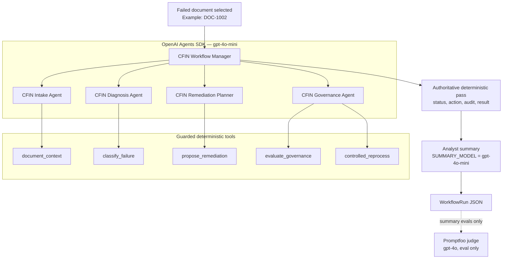

# Evals Journey Log

> **Your personal reference for this project's eval work.**  
> Session log, status, decisions, commands, and a ground-up eval concepts guide. Updated at the end of each eval session.

**Last updated:** 2026-06-28  
**Current phase:** Live on Railway — workbench deployed with Docker, volume, Langfuse  
**Starter docs:** DOC-1001 … DOC-1010 (full golden set)

---

## How to use this file

| If you want to… | Read… |
|-----------------|-------|
| See what we did and in what order | [Session log](#session-log) below |
| See current status at a glance | [Status board](#status-board) |
| See whether the eval loop is complete | [End-to-end eval loop](#end-to-end-eval-loop) |
| Understand why Excel stayed at 3 docs | [Why Excel was left at 3 docs](#why-excel-was-left-at-3-docs) |
| Understand CI and local test scripts | [`CI.md`](CI.md) |
| Re-run evals | [Commands cheat sheet](#commands-cheat-sheet) |
| Learn eval concepts (what/why, taxonomy, golden sets, judges) | [Evals concepts (ground-up guide)](#evals-concepts-ground-up-guide) |
| Understand Promptfoo + judge | [`promptfoo.md`](promptfoo.md) |
| See golden labels and human scores | `AI Evals_SM5_v0.6.xlsx` (3 human-labeled docs + rubric) |

**Maintenance rule:** At the end of each eval session, append a new entry to the [Session log](#session-log) and update the [Status board](#status-board). Agents working in this repo should follow this rule when eval work progresses.

---

## Status board

| Layer | Status | Notes |
|-------|--------|-------|
| Deterministic evals (workflow) | ✅ Done | 12/12 Promptfoo passing |
| Golden dataset (automation) | ✅ Done | 10 docs in `evals/summary_cases.yaml` |
| Golden dataset (human Excel) | ✅ Done (by design) | 3 docs + rubric + 6 calibration rows — see [Why Excel was left at 3 docs](#why-excel-was-left-at-3-docs) |
| Rubric + gate rule | ✅ Done | accuracy ≥ 4 **and** actionability ≥ 4 |
| Human calibration examples | ✅ Done | 6 pass/fail rows in Excel |
| Live manual scoring | ✅ Done | 3/3 starter docs scored after prompt fixes |
| Code + prompt fixes | ✅ Done | Root cause, approval, and manual mapping wording |
| `summary_cases.yaml` | ✅ Done | Machine-readable golden copy (10 docs) |
| Summary Promptfoo provider | ✅ Done | Returns `agent_summary` |
| LLM-as-judge wired | ✅ Done | `src/cfin_agents/summary_judge.py` |
| Judge calibration (automated) | ✅ Done | **6/6** agreed with human labels |
| Live judged evals (automated) | ✅ Done | **10/10 pass** on multi-agent path (`eval-dly-2026-06-25T16:35:05`) |
| Multi-agent workflow evals | ✅ Done | `gpt-4o-mini` agents + summary, `gpt-4o` judge — **51/51** full suite |
| POC eval methodology | ✅ Done | Full loop validated |
| Golden expansion (10 docs) | ✅ Done | `evals/summary_cases.yaml` — all 10 scenarios |
| CI eval gate | ✅ Done | `.github/workflows/ci.yml` — deterministic on PR; summary on dispatch |
| Eval result logging | ✅ Done | `evals/model_outputs.jsonl` + Promptfoo viewer |
| Langfuse observability | ✅ Done | Workflow traces + `analyst-summary` generation span |
| Railway deployment | ✅ Live | `Dockerfile` + `railway.json`; volume at `/data`, `FINHUB_DATA_DIR=/data/finhub` |
| Architecture docs | ✅ Done | `docs/ARCHITECTURE.md` |
| Workbench UI (self-contained demo) | ✅ Done | Reset/seed/sweep in UI; `operator_status` model |
| Runtime persistence | ✅ Done | `FINHUB_DATA_DIR`, SQLite, local/S3 attachments |

---

## End-to-end eval loop

This is the full AI eval methodology we built. For all **10** synthetic failure scenarios, every step below is complete in YAML/automation.

### Flow


### What is complete (POC)

| Step | Status | Evidence |
|------|--------|----------|
| Define what "good" looks like | ✅ | Golden dataset + rubric in Excel/YAML |
| Human labels as source of truth | ✅ | 3 human-labeled in Excel; 10 in YAML (7 pattern-derived) |
| Rubric with pass gate | ✅ | accuracy ≥ 4 **and** actionability ≥ 4 |
| Calibrate judge vs humans | ✅ | 6/6 calibration pass |
| Automate runs | ✅ | Promptfoo + shell scripts |
| Test real workflow output | ✅ | Multi-agent path (`openai_agents_sdk_guarded`) |
| Two eval layers | ✅ | Deterministic (structure) + Summary (quality) |
| Full suite green | ✅ | Deterministic 12/12; calibration 6/6; summary **10/10** |

**One-line summary:** The **eval methodology and scale + ops layer are complete** for portfolio sharing. Optional polish: screenshots, public repo hygiene, repeated judge runs for variance tracking.

### What is not complete yet (optional polish)

| Gap | Why it matters |
|-----|----------------|
| **Portfolio visuals** | Recruiters respond better to screenshots/GIFs |
| **Public repo hygiene** | Rotate keys, verify `.env` never committed |
| **Judge variance tracking** | Repeated runs build confidence beyond one green batch |
| **Production monitoring** | Evals test the prototype; they do not watch live traffic |

### Checklist — "done for real"

- [x] Expand golden dataset to all 10 synthetic docs
- [x] Run summary evals in CI on prompt/model changes (manual workflow dispatch)
- [x] Log judge scores + reasoning to `evals/model_outputs.jsonl` (+ optional Excel export)
- [x] Eval result logging (JSONL + Promptfoo viewer)
- [x] Railway deployment guide
- [ ] Add screenshots / demo GIF for portfolio
- [ ] Re-calibrate judge only when rubric or `SUMMARY_JUDGE_MODEL` changes

See [Why Excel was left at 3 docs](#why-excel-was-left-at-3-docs) for the rationale — Excel sync is intentionally not planned.

---

## Why Excel was left at 3 docs

**Decision:** Keep `AI Evals_SM5_v0.6.xlsx` as-is (3 human-labeled golden docs + rubric + 6 calibration rows). Do **not** extend Excel to all 10 scenarios.

**Portfolio framing:** Excel was the **human methodology layer** — it defines what “good” looks like and calibrates the LLM judge. YAML scales that standard to full regression coverage. See [How to phrase it](#how-to-phrase-it-portfolio) below.

### What Excel actually did

Excel is **not** the automation runtime. Promptfoo and CI read from `evals/summary_cases.yaml`. Excel established the human benchmark:

| Excel role | What it established |
|------------|---------------------|
| **Golden_Dataset (3 docs)** | What “good” looks like — root cause, status, action, must mention / must not say, example summaries for **three policy shapes** (DOC-1001, DOC-1002, DOC-1006) |
| **Rubric** | How to score — accuracy + actionability as pass gates (each ≥ 4) |
| **Model_Outputs (6 rows)** | Judge calibration — fixed good/bad summaries with human pass/fail labels |

Excel answers: *“What is correct, and how do we score it?”*

### What YAML / Promptfoo do

`evals/summary_cases.yaml` (**10 docs**) is the **automated regression benchmark**. It scales coverage after the human standard was set:

- **3 rows** mirror the human-labeled Excel exemplars (one per policy shape).
- **7 rows** apply the same patterns to remaining entity types (vendor, customer, asset, other mapping types, etc.).
- Those 7 were validated by the **calibrated** LLM judge — not re-scored by humans in Excel.

That split is intentional and defensible:

> We used a small human golden set to define quality and calibrate the LLM judge. Once calibrated, we scaled regression testing to all 10 synthetic scenarios in YAML.

### Golden set vs judge calibration

These are related but not the same thing:

| Concept | Purpose |
|---------|---------|
| **Golden set** | Defines the *truth* — what the summary should say (root cause, status, action, constraints) |
| **Judge calibration** | Checks the judge *agrees with humans* on pass/fail before trusting it on live workflow output |

The **3 Excel golden docs** anchor both (one exemplar per policy shape). The **6 calibration rows** are what prove the judge is trustworthy — they are fixed summaries with known human pass/fail labels, not live workflow runs.

Calibration path: `evals/promptfoo_summary_calibration_config.yaml` → **6/6** agreed with human labels.

### How to phrase it (portfolio)

> I built a human golden dataset and rubric to define what a good finance analyst summary looks like, then calibrated an LLM-as-judge against human pass/fail examples. That calibrated judge automates summary quality evals in CI. The original Excel workbook captures the human benchmark; YAML extends it to full scenario coverage for regression testing.

This is accurate without overclaiming that all 10 docs were human-labeled.

### What we claim vs what we do not claim

| Claim | Supported? |
|-------|------------|
| Human golden labels for **3 exemplar docs** (one per policy shape) | ✅ Yes — Excel v0.6 |
| Judge calibrated against **6 human-scored examples** | ✅ Yes — calibration 6/6 |
| Automated regression over **10 synthetic scenarios** | ✅ Yes — `summary_cases.yaml` + Promptfoo |
| All 10 golden rows were individually human-scored in Excel | ❌ No — 7 are pattern-derived + judge-validated |

### Three policy shapes (why 3 human docs were enough)

Each human-labeled doc represents a distinct remediation policy — not just a different master-data entity:

| Shape | Human exemplar | YAML also covers | Root cause | Approval? |
|-------|----------------|------------------|------------|-----------|
| Missing master data | DOC-1001 | 1003, 1005, 1008, 1009, 1010 | Entity master data missing | Yes |
| Missing mapping only | DOC-1002 | 1004, 1007 | Source-to-target mapping missing | No |
| Closed period | DOC-1006 | — | Posting period closed | Blocked (controller) |

Once the rubric and judge agree with humans on these three shapes, extending YAML to the remaining entity types is a **coverage** step, not a new methodology step.

### Leaving Excel as-is — checklist update

- [x] **Intentionally** keep Excel at 3 human golden docs + 6 calibration rows
- [x] Scale automation golden set to 10 docs in YAML
- [ ] Sync Excel `Golden_Dataset` with 7 new rows — **not planned** (optional only if full human parity is needed later)

---

## Multi-agent workflow reference

This is the current default workflow when `OPENAI_API_KEY` is set and `DISABLE_LLM=0`. The OpenAI Agents SDK coordinates the work, while deterministic Python services remain the source of truth for policy, approval gates, and reprocessing.

### Agents and models

| Component | Model | What it does |
|-----------|-------|--------------|
| `CFIN Workflow Manager` | `OPENAI_MODEL` → `gpt-4o-mini` | Coordinates the full sequence: intake, diagnosis, remediation planning, governance, and controlled reprocess. |
| `CFIN Intake Agent` | `OPENAI_MODEL` → `gpt-4o-mini` | Gathers the failed document, validation issues, and existing mappings. |
| `CFIN Diagnosis Agent` | `OPENAI_MODEL` → `gpt-4o-mini` | Calls the deterministic classifier for failure scenario, reason code, root cause, and evidence. |
| `CFIN Remediation Planner` | `OPENAI_MODEL` → `gpt-4o-mini` | Calls the planner to choose the remediation action and whether approval is required. |
| `CFIN Governance Agent` | `OPENAI_MODEL` → `gpt-4o-mini` | Calls policy guardrails and reprocesses only when allowed. |
| Analyst summary writer | `SUMMARY_MODEL` → `gpt-4o-mini` | Writes the final finance-analyst summary from the structured workflow output. |
| LLM judge | `SUMMARY_JUDGE_MODEL` → `gpt-4o` | Scores `agent_summary` during Promptfoo summary evals only. |

The agents do not directly mutate enterprise state. They call guarded tools backed by deterministic services:

| Tool | Backing service | Purpose |
|------|-----------------|---------|
| `document_context` | Repository + `Validator` | Load the document, validation issues, and mappings. |
| `classify_failure` | `DiagnosisService` | Return reason code and root cause. |
| `propose_remediation` | `RemediationPlanner` | Return the remediation plan. |
| `evaluate_governance` | `PolicyEngine` | Decide whether the plan is allowed, blocked, or approval-gated. |
| `controlled_reprocess` | `ReprocessingService` | Reprocess only if policy allows it. |

### Flowchart



### End-to-end example: `DOC-1002`

`DOC-1002` enters the workflow from the synthetic failed-document queue. The manager starts with the Intake Agent, which calls `document_context` to load the source document, target validation issues, and available mappings.

The Diagnosis Agent calls `classify_failure`. The deterministic classifier returns `MP_COST_CENTER_SOURCE_TO_TARGET_MAPPING_MISSING`: the target cost center exists, but the source cost center is not mapped to it.

The Remediation Planner calls `propose_remediation`. The plan is `maintain_source_mapping`: the analyst manually maintains the missing source-to-target mapping in the target mapping table, then the document can be reprocessed. This does not require approval because no target master data is being created.

The Governance Agent calls `evaluate_governance`. The policy engine allows the action because mapping maintenance is permitted, unlike master-data creation without approval or closed posting periods. The Governance Agent can then call `controlled_reprocess`, which simulates reprocessing under guardrails.

After orchestration completes, the deterministic workflow runs as the final authoritative pass. It records the final status, reason code, action, reprocess result, and audit events. The analyst summary writer then uses `gpt-4o-mini` to produce a short summary such as:

```text
Document posting failed because the cost center source-to-target mapping is missing. Maintain the missing mapping entry manually in the target mapping table, then reprocess the document. No approval is required.
```

During Promptfoo summary evals only, the `gpt-4o` LLM judge scores that summary against the golden dataset and rubric.

---

## Session log

### 2026-06-28 — Railway live deploy

**Focus:** Production deployment on Railway with Docker, volume persistence, and doc alignment.

**Delivered:**

- Switched Railway build from Nixpacks to multi-stage **`Dockerfile`** (Node 22 + Python 3.11/uv)
- Pinned frontend to **Vite 6** for reliable Linux builds
- Live service verified: workbench UI, agent sweep, ticket triage, attachments, Langfuse traces
- Railway Volume at `/data` with `FINHUB_DATA_DIR=/data/finhub`, `RAILWAY_RUN_UID=0`
- Updated `README.md`, `DEPLOYMENT.md`, `ARCHITECTURE.md` with current Railway UI (⌘K volume creation)

**Next:** Portfolio screenshots; optional custom domain.

---

### 2026-06-28 — Workbench, persistence, Langfuse, Railway, docs

**Focus:** Product-ready demo surface, observability, and documentation alignment for Railway deploy.

**Delivered:**

- Self-contained workbench loop (reset/seed, agent sweep, refresh) — no terminal dependency for demos
- Simplified ticket model: single `operator_status`; policy in `workflow_run` / agent diagnosis
- Durable runtime state: `FINHUB_DATA_DIR`, SQLite tickets, local or S3 attachment storage
- Agent diagnosis hero in ticket detail; analytics panel consolidated; Langfuse trace link
- Langfuse v4 integration: `workflow_observation` root span + `analyst-summary` generation for `SUMMARY_MODEL`
- Production static frontend serving + **Dockerfile** deploy; same-origin API URLs for Railway
- Full architecture doc: `docs/ARCHITECTURE.md`
- Updated `README.md`, `CLAUDE.md`, `DEPLOYMENT.md`, `finhub.md`, `.env.example`
- Code pushed to GitHub (`main`) for Railway deploy-from-repo

**Next:** Railway service variables + volume mount at `FINHUB_DATA_DIR=/data/finhub`; portfolio screenshots.

---

> Historical entries below reflect point-in-time state. For current status, see the [Status board](#status-board) above.

### Session 1 — Deterministic evals foundation

**Goal:** Prove workflow behavior is correct with exact checks.

**What we did:**
- Ran deterministic test suite (`evals/deterministic_cases.yaml`)
- 12 Promptfoo cases covering all 10 synthetic docs (+ approval variants)
- Validated status, reason code, action, approval, reprocess outcome

**Outcome:** ✅ All deterministic evals passing.

**Key learning:** Deterministic evals answer *“Did the system do the right thing structurally?”* They cannot judge free-form English summaries.

---

### Session 2 — Human golden dataset + rubric

**Goal:** Define what a *good* analyst summary looks like for 3 policy shapes.

**What we did:**
- Built `AI Evals_SM5_v0.xlsx` workbook:
  - **Golden_Dataset** tab — truth per doc
  - **Rubric** tab — scoring dimensions + gate rule
  - **Model_Outputs** tab — calibration + live scores
- Started with 3 docs (one per policy shape):
  - **DOC-1001** — missing master data → needs approval
  - **DOC-1002** — missing mapping → analyst manually maintains mapping, then reprocesses
  - **DOC-1006** — closed period → blocked

**Key columns added over iterations:**
- `ROOT_CAUSE_EXPECTED` — why the doc failed (separate from remediation)
- `REQUIRED_FOLLOW_ON` — e.g. `maintain_source_mapping` after `create_target_master_data`
- `MUST_MENTION` / `MUST_NOT_SAY` — judge guidance

**Key decisions:**
- `APPROVAL_REQUIRED?` kept as simple True/False (human gate before proceeding)
- Root cause for master-data cases is **missing master data**, not missing mapping

**Outcome:** ✅ Golden dataset v0.6 ready for 3 starter docs.

---

### Session 3 — Manual scoring + prompt fixes

**Goal:** Score live `agent_summary` outputs by hand; fix code where summaries were wrong.

**What we did:**
- Ran live demos for DOC-1001, DOC-1002, DOC-1006
- Scored against golden + rubric manually
- Fixed issues found:

| Issue | Doc | Fix |
|-------|-----|-----|
| Summary said missing **mapping** was root cause | DOC-1001 | Updated error messages, diagnosis evidence, summary prompt |
| Summary said action was **“approved”** for a mapping-maintenance case | DOC-1002 | `_summary_policy_decision()` + MP_* prompt rules |

**Live manual results (after fixes):**

| Doc | Pass? | Notes |
|-----|-------|-------|
| DOC-1001 | ✅ Pass | Full remediation sequence present |
| DOC-1002 | ✅ Pass (v2) | Mapping action clear, no false approval |
| DOC-1006 | ✅ Pass | Blocked + controller escalation |

**Outcome:** ✅ Human loop validated end-to-end for 3 docs.

---

### Session 4 — Promptfoo automation prep

**Goal:** Make codebase and docs ready for automated summary evals.

**What we did:**
- Created `evals/summary_cases.yaml` (YAML copy of golden labels)
- Created `evals/summary_provider.py` (runs workflow, returns summary)
- Created `evals/promptfoo_summary_config.yaml`
- Created `scripts/run_summary_evals.sh`
- Updated README, CLAUDE, Evals-Journey, promptfoo.md

**Outcome:** ✅ Infrastructure ready; judge not yet wired.

---

### Session 5 — LLM-as-judge + calibration

**Goal:** Automate human scoring; prove judge agrees with human labels before trusting it on live runs.

**What we did:**
- Built `src/cfin_agents/summary_judge.py` — judge prompt + dual gate rule
- Built `evals/summary_assertions.py` — smoke + judge + calibration assertions
- Built calibration suite:
  - `evals/summary_calibration_cases.yaml` — 6 fixed summaries
  - `evals/promptfoo_summary_calibration_config.yaml`
  - `scripts/run_summary_calibration.sh`
- Ran calibration: **6/6 pass** (judge matched human pass/fail on all examples)

**Outcome:** ✅ Judge calibrated. Ready for live judged evals.

**Key learning:** Calibration answers *“Does the judge agree with me on examples I already scored?”* Always do this before expanding scope.

---

### Session 6 — Live judged evals (automated)

**Goal:** Run the full automated loop — workflow generates fresh summaries, LLM judge scores them.

**What we ran:**

```bash
bash scripts/run_summary_evals.sh
```

**Step 1 — Calibration (again):** ✅ 6/6 pass

**Step 2 — Live judged evals:**

| Doc | Promptfoo result | Judge scores (follow-up check) |
|-----|------------------|--------------------------------|
| DOC-1001 | ✅ Pass | accuracy=5, actionability=5 |
| DOC-1002 | ❌ Fail | accuracy=5, actionability=4 (pass on re-check) |
| DOC-1006 | ✅ Pass | accuracy=5, actionability=5 |

**Outcome:** First automated run **2/3 pass**. The full human → Promptfoo → judge loop is working.

**What we learned:**
- The automated pipeline works end-to-end for the first time.
- DOC-1002 failed on the first Promptfoo run but passed on an immediate re-check — likely **judge variance** and/or a slightly different generated summary (actionability borderline).
- This is normal with LLM judges: calibration on fixed text ≠ perfect stability on fresh generations.

**Possible next tweaks (optional):**
- Run each live case 2–3 times and track pass rate
- ~~Tighten summary prompt for DOC-1002 conciseness/actionability~~ ✅ Done (Session 6b)
- Log judge reasoning to Excel `Model_Outputs` automatically

---

### Session 6b — DOC-1002 prompt + golden alignment

**Goal:** Stabilize DOC-1002 live judged evals with clearer target mapping table language.

**What we changed:**
- `services.py` — MP_* / `maintain_source_mapping` prompt now uses clearer mapping language:
  root cause → maintain mapping entry → reprocess guidance
- `summary_cases.yaml` — updated DOC-1002 golden example + `must_mention`
- `summary_calibration_cases.yaml` — updated DOC-1002 pass calibration row
- `summary_judge.py` — judge checks mapping-maintenance cases against the no-approval policy shape

**Verification:** DOC-1002 judged **3/3 pass** on consecutive runs.

---

### Session 6d — DOC-1002 domain correction (manual mapping)

**User correction:** The system does **not** auto-update the mapping table.
Mapping maintenance is a **manual analyst action**.

**What we fixed:**
- Removed all "auto-remediated / system automatically updated mapping" language
- Prompt now requires: analyst manually maintains mapping in target mapping table, then reprocesses
- Golden, calibration, and judge updated accordingly

**Example correct summary:**
> Document posting failed because the cost center source-to-target mapping is missing. Maintain the missing mapping entry manually in the target mapping table, then reprocess the document. No approval is required.

Full suite re-run: **9/9 pass**.

---

**Command:** `bash scripts/run_summary_evals.sh`

| Stage | Result |
|-------|--------|
| Unit tests | 6/6 pass |
| Calibration | 6/6 pass |
| Live judged evals | **3/3 pass** |

Promptfoo eval ID: `eval-WoC-2026-06-25T08:33:47`

**Outcome:** ✅ Full automated summary eval pipeline green for all 3 starter docs.

---

### Session 7 — Multi-agent switch + full suite on gpt-4o-mini

**Goal:** Switch from forced-deterministic summary evals to the full multi-agent workflow; validate end-to-end on new model config.

**What we changed:**
- Default path: OpenAI Agents SDK orchestration (`DISABLE_LLM=0`)
- Agents + summary: `gpt-4o-mini` (`OPENAI_MODEL`, `SUMMARY_MODEL`)
- Judge: `gpt-4o` (`SUMMARY_JUDGE_MODEL`)
- Fixed `gpt-5-mini` temperature API errors by moving to `gpt-4o-mini`
- Updated docs for multi-agent workflow and manual-mapping domain rules

**Full suite results:**

| Stage | Result |
|-------|--------|
| Pytest deterministic | 30/30 pass |
| Smoke check | pass |
| Promptfoo deterministic | 12/12 pass (`eval-dnT-2026-06-25T09:18:15`) |
| Judge calibration | 6/6 pass (`eval-Q1Y-2026-06-25T09:18:42`) |
| Live summary evals | 3/3 pass (`eval-Yo2-2026-06-25T09:18:52`) |
| **Total** | **51/51** |

All live runs confirmed `execution_mode: openai_agents_sdk_guarded`.

**Outcome:** ✅ POC eval pipeline complete for 3 starter docs. Ready to scale golden dataset to 10 docs.

---

### Session 8 — Scale + ops (10 docs, CI, dashboard, logging, Railway)

**Goal:** Complete the scale + ops checklist for portfolio readiness.

**What we built:**
- Expanded `evals/summary_cases.yaml` from 3 → **10** golden docs
- Added `src/cfin_agents/eval_results.py` + `scripts/log_summary_eval_results.py`
- Results log to `evals/model_outputs.jsonl` with optional Excel export
- Eval result log: `evals/model_outputs.jsonl`
- GitHub Actions: `.github/workflows/ci.yml` (deterministic on PR, summary on dispatch)
- Railway guide: `DEPLOYMENT.md`
- README portfolio pitch + updated eval commands

**Commands:**

```bash
bash scripts/run_deterministic_evals.sh      # CI parity
bash scripts/run_summary_evals.sh            # Promptfoo + JSONL log
bash scripts/run_summary_eval_batch.sh       # programmatic batch + log
bash scripts/dev-workbench.sh                # backend :8000 + frontend :5173
```

**Outcome:** ✅ Scale + ops layer complete. **10/10** summary evals green (`eval-dly-2026-06-25T16:35:05`); JSONL batch **10/10** (`eval-20260625T164027Z`). Project is portfolio-ready pending visuals and public repo hygiene.

---

## Commands cheat sheet

### Quick scripts

```bash
# From project root — load API key first for summary evals
set -a && source .env && set +a

# Deterministic evals (no API key required)
bash scripts/run_deterministic_evals.sh

# Judge calibration only (6 human pass/fail examples)
bash scripts/run_summary_calibration.sh

# Calibration + live judged evals (10 docs) + JSONL log
bash scripts/run_summary_evals.sh

# Programmatic batch + log only
bash scripts/run_summary_eval_batch.sh

# Manual single-doc runs
uv run cfin-demo DOC-1001
uv run cfin-demo DOC-1002
uv run cfin-demo DOC-1006
```

---

### Run Promptfoo directly

Environment variables used by all Promptfoo commands in this project:

```bash
export PROMPTFOO_CONFIG_DIR=.promptfoo
export PROMPTFOO_DISABLE_WAL_MODE=true
export PROMPTFOO_PYTHON=.venv/bin/python
```

**Deterministic evals** (`evals/promptfooconfig.yaml` — 12 cases, no API key):

```bash
npx promptfoo eval -c evals/promptfooconfig.yaml
```

**Summary calibration** (`evals/promptfoo_summary_calibration_config.yaml` — needs API key):

```bash
set -a && source .env && set +a
npx promptfoo eval -c evals/promptfoo_summary_calibration_config.yaml
```

**Live summary evals** (`evals/promptfoo_summary_config.yaml` — needs API key):

```bash
set -a && source .env && set +a
npx promptfoo eval -c evals/promptfoo_summary_config.yaml
```

Terminal output shows a live table with `[PASS]` / `[FAIL]` as each case completes.

---

### View results in the browser

After running evals, start the Promptfoo viewer:

```bash
cd /path/to/finhub
PROMPTFOO_CONFIG_DIR=.promptfoo npx promptfoo view
```

Open: **http://localhost:15500**

| What you can do in the viewer | Why it helps |
|-------------------------------|--------------|
| Browse all past eval runs | Compare before/after prompt changes |
| Click a test row | See full `agent_summary` output |
| Expand failed assertions | Read LLM judge reasoning |
| Filter by eval ID | Find a specific run (e.g. after `run_summary_evals.sh`) |

Leave the viewer running while you work — it picks up new eval runs automatically.
Stop it with `Ctrl+C` in the terminal.

See [`promptfoo.md`](promptfoo.md) section 12 for full details and a config decision flowchart.

---

## Key concepts (quick reference)

| Term | Meaning |
|------|---------|
| Golden dataset | Source of truth for what a correct output must contain |
| Rubric | How to score; gate = accuracy ≥ 4 **and** actionability ≥ 4 |
| Calibration | Fixed summaries with human pass/fail labels; validates the judge |
| Promptfoo | Test runner for workflow + judge assertions |
| LLM judge | Scores natural-language `agent_summary` during summary evals |

**Two eval layers:** deterministic (structure) + summary (analyst text quality).

**Deep dive:** [Evals concepts (ground-up guide)](#evals-concepts-ground-up-guide) · **Policy shapes:** [Why 3 human docs were enough](#three-policy-shapes-why-3-human-docs-were-enough) · **Promptfoo wiring:** [`promptfoo.md`](promptfoo.md)

---

## Evals concepts (ground-up guide)

> General AI eval concepts with examples from this project. For what we built and when, see the [Session log](#session-log) and [Status board](#status-board) above.

### Layer 1 — What & Why

#### The core problem

When you write a normal function, you always know if it works. You call it with an input, check the output, done.

```python
def add(a, b):
    return a + b

assert add(2, 3) == 5  # Either passes or fails. No ambiguity.
```

With an LLM, you don't have this luxury. The output is non-deterministic (run the same prompt twice and you might get two different answers), probabilistic, and almost always in free-form natural language. Two completely different outputs can both be "correct." One output can be half-right in ways that are genuinely hard to measure.

**Evals are the answer to: "How do I know if my AI system is actually working?"**

Not just "does it run without crashing." That's a low bar. The real questions are:

- Is it producing the *right* outputs for the right inputs?
- If I tweak the prompt, did quality go up or down?
- When I switch from GPT-4o to Claude Sonnet, what actually changes?
- Is my system getting better or worse over time?
- If I deploy this to 10,000 users, what fraction will get a bad experience?

Without evals, you cannot answer any of these questions confidently. You're guessing.

#### A concrete example

Imagine you built a customer support bot. A user asks: *"How do I reset my password?"*

Your bot responds: *"You can reset your password by clicking 'Forgot Password' on the login page. If that doesn't work, contact support@company.com."*

Is that good? Maybe. But:
- What if the support email changed last month?
- What if the 'Forgot Password' flow is broken?
- What if the user asked in Spanish and the bot responded in English?
- What if 1 in 10 times the bot says "I don't know" instead?

Evals let you catch all of this — systematically, before your users do.

#### Why this especially matters for AI PMs

As a product manager, evals are your **north star metric for AI quality.** Without them:

- Every prompt change is a guess with no feedback loop
- Every model upgrade is a bet you can't validate
- Every bug report from a user is a surprise you could have caught earlier
- You have no evidence for product decisions ("should we upgrade the model? spend more on tokens?")

With evals, you have:
- A **baseline** — what does the system do today?
- A way to detect **regressions** — did my change break anything?
- **Evidence** for decisions — "switching models improved quality scores by 12% at 30% lower cost"
- A **forcing function for clarity** — writing evals forces you to answer: *what does "good" actually mean here?*

That last point is underrated. Many AI products fail not because of bad models but because nobody defined success clearly enough to know when they had it.

---

### Layer 2 — The Taxonomy

There are exactly **3 types of evals**. Everything you'll ever encounter is a variation of one of these. Learn these three and you have the mental model for everything.

---

#### Type 1: Deterministic Evals

The output is checked by **code**. A second LLM is not involved in judging the result. You know what the right answer is, and you assert it directly.

```python
output = run_workflow("DOC-1002")

assert output.status == "reprocessed"       # Did it take the right action?
assert output.diagnosis.reason_code == "MP_COST_CENTER_SOURCE_TO_TARGET_MAPPING_MISSING"
assert output.diagnosis.failure_scenario == "cost_center_source_mapping_missing"
```

**When to use**: When there is a correct answer. A known expected output. A schema that must be followed. A field that must not be null. A decision that should always be the same for a given input.

**Real example from this project**: Every case in `evals/deterministic_cases.yaml` has a documented expected outcome. DOC-1006 (closed posting period) should always be `blocked`. DOC-1002 (missing cost center source-to-target mapping) should always be `reprocessed` after mapping maintenance with no approval required. There's no ambiguity — the system either got it right or it didn't. `tests/test_deterministic_cases.py` runs all of these on every test run.

**Pros**:
- Extremely fast (milliseconds per case)
- Cheap (no API calls to judge)
- Perfectly reproducible (same result every time)
- Easy to debug (a failing assertion tells you exactly what went wrong)

**Cons**:
- Can't evaluate quality, tone, clarity, or nuance
- Only works when you know the right answer in advance
- Useless for open-ended outputs

---

#### Type 2: Model-Graded Evals (LLM-as-Judge)

You use a **second LLM** to judge the output of the first LLM. The judge reads the input, the output, and optionally a rubric, and returns a score or a verdict.

```
User Input → [Your AI System] → Output
                                     ↓
                        [Judge LLM] → Score (1–5) + Reasoning
```

**A concrete example**: Say your AI system produces a written explanation alongside the structured output for DOC-1002 (missing cost center source-to-target mapping):

> *"This document failed because the source cost center did not have a maintained target mapping. No new cost center master data was needed, so the mapping was maintained and the document was reprocessed."*

You can't exact-match this — there are many correct ways to word it. But you can ask a judge LLM:

> "Here is the document context. Here is the system's explanation. Rate the explanation on accuracy (1–5) and explain your reasoning."

The judge reads both and gives you a score. At scale, across hundreds of explanations, this gives you a quality signal.

**When to use**: When the output is natural language and "correctness" requires judgment. Is this explanation clear? Is this diagnosis accurate? Is this recommendation reasonable? Does this response actually help the user?

**Pros**:
- Scales to thousands of examples automatically
- Handles nuance and natural language quality
- Can evaluate things that only humans could previously evaluate

**Cons**:
- The judge can be wrong. LLMs have biases (they tend to favor longer responses, more confident tones, and outputs that resemble their own style)
- Requires calibration — you need to validate that the judge agrees with human raters
- Adds cost (you're now paying for two LLM calls per eval)
- Can be manipulated — if your system learns to "write for the judge," scores go up but real quality doesn't

---

#### Type 3: Human Evals

A human reads the output and rates it. This is the gold standard.

**When to use**:
- When building your golden dataset (humans provide the ground truth labels)
- When calibrating your model-graded evals (checking if the judge agrees with humans)
- When the stakes are high and you need the most accurate signal possible
- Periodically, to audit whether your automated evals are still tracking reality

**Pros**:
- Highest accuracy
- Can catch subtle quality issues that automated evals miss
- The ultimate source of truth

**Cons**:
- Expensive
- Slow (doesn't scale)
- Inconsistent across raters (inter-rater agreement is a real problem)
- Creates a bottleneck in your development loop

---

#### How they work together

Think of these as a pyramid, not alternatives:

```
         ▲
        / \
       /   \  Human Evals
      /     \  (ground truth, expensive, periodic)
     /-------\
    /         \  Model-Graded Evals
   /           \  (scales, needs validation, run on significant changes)
  /-------------\
 /               \  Deterministic Evals
/                 \  (fast, cheap, run on every single commit)
-------------------
```

In practice:
- **Deterministic evals** run on every commit in CI/CD. They catch regressions instantly.
- **Model-graded evals** run when you make a meaningful change — new prompt, new model, new feature.
- **Human evals** are done upfront to build your golden dataset, and periodically to audit whether your automated evals are still meaningful.

A good eval strategy uses all three layers. Relying on only one is a mistake.

---

### Layer 3 — Golden Datasets

#### What it is

A golden dataset is a curated set of **`(input → expected output)`** pairs that defines what "correct" looks like for your specific system. It is the foundation that all your evals are built on.

In your project, `evals/deterministic_cases.yaml` is exactly this. Here's a real entry:

```yaml
- id: cost_center_source_mapping_missing_mapping_maintenance
  document_id: DOC-1002
  approve: false
  expected:
    status: reprocessed
    reason_code: MP_COST_CENTER_SOURCE_TO_TARGET_MAPPING_MISSING
    failure_scenario: cost_center_source_mapping_missing
```

That's a golden case. The input is `DOC-1002` with `approve=false`. The expected output is `status=reprocessed` with the cost center source-mapping reason code. If you run the system against this input and get anything else, something is broken.

Scale this up to dozens or hundreds of cases, cover different scenarios and edge cases, and you have a golden dataset.

#### How to build one (step by step)

**Step 1 — Identify your coverage axes**

What are the meaningful dimensions of variation in your inputs? You want your dataset to cover all of them.

For your project, the axes are:
- **Failure type** — 10 scenarios across 3 policy shapes: missing source-to-target mapping (MP_*), missing target master data (MD_*), and closed posting period (DC_*)
- **Approval state** — approved vs. not approved (relevant for master-data cases; mapping-maintenance cases reprocess without approval)

Cover every axis. Cover happy paths (things that should succeed) and failure paths (things that should be blocked or held for approval).

**Step 2 — Generate candidate inputs**

The best source is **real usage data** from production. If your system is live, sample actual inputs that users sent. These are guaranteed to be realistic.

If your system isn't live yet (or you can't use real data for privacy reasons), generate **synthetic examples** — like your project does with `data/synthetic/documents.json`. Synthetic is fine for prototypes, but make sure the examples are realistic enough to be meaningful.

**Step 3 — Label the expected outputs**

This is the hard part. For each input, a human (you, or a domain expert) decides what the correct output should be. This is your ground truth.

This forces you to answer hard questions:
- What *exactly* should happen when a cost center mapping is missing vs. when it exists but wasn't applied?
- Should a missing vendor ever proceed without approval, or always require approval?
- What does "blocked" mean — blocked forever (posting period), or blocked pending approval (master data)?

If you can't answer these clearly, you don't have a spec. Fix the spec before writing labels.

**Step 4 — Review for disagreements**

If two people label the same input differently, that's a signal. It means the task is ambiguous. Don't resolve it by picking one person's label — resolve it by clarifying the spec, then re-labeling.

Inter-rater agreement (the % of cases where two independent raters agree) is a metric worth tracking. If it's below ~80%, your task definition probably needs more work.

**Step 5 — Split into eval set and test set**

Don't optimize your system against the same cases you evaluate it on — you'll overfit. Reserve 20–30% of cases as a **held-out test set** that you only use for final reporting, not during development. Use the rest as your working eval set.

---

#### The traps everyone falls into

**Trap 1 — Dataset too small**

Five cases is not a dataset. If you have 5 cases and your system passes all 5, you know almost nothing. A meaningful regression could be hidden. A real system needs enough cases that failure in one area can't be masked by passes elsewhere.

A rough guideline: at minimum, 10–20 cases per meaningful scenario. More is always better.

**Trap 2 — Only happy path cases**

It's tempting to write cases where everything goes right. But your users will hit edge cases, malformed inputs, ambiguous situations, and error conditions. Your eval set should reflect that — roughly half your cases should be failure/edge cases.

Your project gets this right: out of 10 synthetic documents, 3 are lower-risk mapping-maintenance cases (DOC-1002, DOC-1004, DOC-1007), 6 are blocked/needs-approval master-data cases, and 1 is a hard block (DOC-1006). That's a healthy ratio.

**Trap 3 — Garbage labels**

If your expected outputs are wrong, your evals are worse than useless. They'll tell you the system is passing when it's actually broken — and you'll be confident about it. Garbage in, garbage out.

Spend real time on your labels. Have domain experts review them. Treat them like production code.

**Trap 4 — Dataset rot**

Your system evolves. Your labels don't automatically evolve with it. An expected output that was correct 6 months ago might be wrong today because the spec changed or new edge cases were discovered. Build a habit of periodically reviewing and pruning your golden dataset.

---

### Layer 4 — Deterministic Evals (in depth)

Deterministic evals are where every eval strategy starts. They are fast, cheap, perfectly reproducible, and require no LLMs to run. But there's more variety here than most people expect — and the way you combine them determines how useful your eval suite actually is.

We'll use a single document throughout this entire section: **DOC-1003** — a missing vendor case with no approval given. Expected behavior: needs_approval, no reprocessing until approved.

---

#### Before you write any assertion — ask this first

**Is this output produced by a rule, or by judgment?**

- **Rule** (deterministic logic, thresholds, policy code) → safe to write a deterministic check
- **Judgment** (LLM reasoning, natural language, ambiguous criteria) → deterministic check will be brittle and unreliable

For example, `reason_code` in this project is assigned by deterministic diagnosis logic — no LLM involved. So `assert output.diagnosis.reason_code == "MD_VENDOR_MASTER_DATA_MISSING"` is a valid, stable assertion. But if a root-cause explanation were written by an LLM in natural language, exact-matching it would break every time the model's wording drifted.

This is the single most important question to ask before writing any deterministic eval.

---

#### The 5 kinds of deterministic checks

All 5 examples below are for the same document: **DOC-1003, missing vendor, no approval**.

---

**1. Exact match**

The output must equal a specific value exactly. Binary: pass or fail.

```python
# DOC-1003 must result in needs_approval — not reprocessed, not blocked
assert output.status == "needs_approval"

# The failure scenario and reason code must be correctly identified
assert output.diagnosis.failure_scenario == "missing_vendor"
assert output.diagnosis.reason_code == "MD_VENDOR_MASTER_DATA_MISSING"

# Policy must block reprocessing until target master-data creation is approved
assert output.governance_decision.allowed is False
```

Best for: categorical outputs — status codes, enum values, classifications. If the output is one of a fixed set of possible values, exact match is the right tool.

Falls apart the moment output has any variability — free text, lists, nested structures. Never exact-match a natural language explanation.

---

**2. Schema validation**

The output must have the right *structure*, regardless of whether the specific values are correct. You're not asking "is the value right?" — you're asking "is the shape right?"

```python
# The diagnosis object must exist — not None
assert output.diagnosis is not None

# The governance decision must exist and have reasons
assert output.governance_decision is not None
assert len(output.governance_decision.policy_reasons) > 0

# The audit trail must have entries
assert len(output.audit_events) > 0

# The document ID must follow the expected format
assert output.document_id.startswith("DOC-")
```

This catches a whole class of bugs: missing required fields, wrong data types, empty lists that should have items, null objects where something should exist.

Your project gets this for free. Because `WorkflowRun`, `Diagnosis`, `RemediationPlan`, and `GovernanceDecision` are all Pydantic models in `models.py`, if the output can't be parsed into the expected shape, the code crashes before your assertions even run. That's schema validation baked into the type system — a good pattern.

---

**3. Containment checks**

The output must *contain* something specific. You're not asserting the exact full value — just that a certain thing is present somewhere within it.

```python
# The audit trail must show that the governance step ran
assert "governance_evaluated" in output.audit_events

# The policy reasons must include the high-value block reason
assert "Master-data mutation requires approval before reprocessing." \
    in output.governance_decision.policy_reasons

# The audit trail must show the governance step ran
assert "governance_evaluated" in output.audit_events
```

Think of containment as: "I don't care about everything else in this list or string — but *this specific thing must be there*." It's looser than exact match, which makes it more resilient when surrounding content changes.

---

**4. Negation checks**

The output must NOT contain something. The mirror of containment — and massively underused.

```python
# DOC-1003 must NEVER be reprocessed without approval
assert output.reprocess_result is None

# The governance decision must NOT have allowed the action
assert output.governance_decision.allowed is False

# The audit trail must NOT contain a reprocess event
assert "reprocessed" not in output.audit_events
```

Negation checks enforce *safety constraints*. For a governed system like this one, they are arguably the most important assertions you can write. The absence of a dangerous action is often more important to verify than the presence of a correct one.

Rule of thumb: for every action the system should *never* take for a given input, write a negation check.

---

**5. Threshold and range checks**

A numeric value must fall within acceptable bounds. You're not asserting an exact number — you're asserting a range.

```python
# The diagnosis must be confident before blocking a missing master data case
assert output.diagnosis.confidence >= 0.85

# The workflow must complete within the latency SLA
assert output.processing_time_ms < 5000

# Confidence must be a valid score — not 1.7, not negative
assert 0.0 <= output.diagnosis.confidence <= 1.0
```

Critical for production systems where you have latency SLAs, cost budgets, or confidence thresholds. Also useful as sanity checks — a confidence score of 1.7 means something is seriously broken upstream.

---

#### Putting it all together for DOC-1003

Here's the complete eval suite for DOC-1003, using all 5 check types:

```python
# 1. Exact match — correct outcome and classification
assert output.status == "needs_approval"
assert output.diagnosis.failure_scenario == "missing_vendor"
assert output.diagnosis.reason_code == "MD_VENDOR_MASTER_DATA_MISSING"

# 2. Schema validation — required objects must exist and be populated
assert output.diagnosis is not None
assert output.governance_decision is not None
assert len(output.governance_decision.policy_reasons) > 0

# 3. Containment — correct steps must appear in the audit trail and policy reasons
assert "governance_evaluated" in output.audit_events
assert "Master-data mutation requires approval before reprocessing." \
    in output.governance_decision.policy_reasons

# 4. Negation — dangerous actions must never have happened
assert output.reprocess_result is None
assert output.governance_decision.allowed is False
assert "reprocessed" not in output.audit_events

# 5. Threshold — confidence must be high enough to act on
assert output.diagnosis.confidence >= 0.85
assert output.processing_time_ms < 5000
```

Each assertion catches a different failure mode. If any one fails, you know exactly which part of the system broke.

---

#### A key insight: outcome vs. path assertions

Imagine a bug is introduced where the PolicyEngine is accidentally skipped. The system goes straight from diagnosis to flagging `needs_approval` — but it never actually evaluated governance.

**An assertion on `status` alone would pass. An assertion on `audit_events` would catch it.**

```python
# Passes even with the bug — the final status happened to be correct
assert output.status == "needs_approval"

# Catches the bug — the governance step never ran
assert "governance_evaluated" in output.audit_events
```

> **Outcome assertions tell you *if* something broke. Path assertions tell you *how* it broke.**

For governed systems — where the process matters as much as the result — always assert on both.

---

#### What good coverage looks like across multiple cases

Once you've written a thorough eval for one document, repeat the pattern for each scenario. Here's the coverage grid for this project:

| Document | Failure Scenario | Reason Code | Expected Status | Key Negation |
|---|---|---|---|---|
| DOC-1002 | Cost center source to target mapping missing | `MP_COST_CENTER_SOURCE_TO_TARGET_MAPPING_MISSING` | `reprocessed` | no `POLICY_BLOCK` in audit |
| DOC-1004 | GL account source to target mapping missing | `MP_GL_ACCOUNT_SOURCE_TO_TARGET_MAPPING_MISSING` | `reprocessed` | no `POLICY_BLOCK` in audit |
| DOC-1007 | Profit center source to target mapping missing | `MP_PROFIT_CENTER_SOURCE_TO_TARGET_MAPPING_MISSING` | `reprocessed` | no `POLICY_BLOCK` in audit |
| DOC-1001 | GL account master data missing | `MD_GL_ACCOUNT_MASTER_DATA_MISSING` | `needs_approval` | `reprocess_result is None` |
| DOC-1005 | Cost center master data missing | `MD_COST_CENTER_MASTER_DATA_MISSING` | `needs_approval` | `reprocess_result is None` |
| DOC-1008 | Profit center master data missing | `MD_PROFIT_CENTER_MASTER_DATA_MISSING` | `needs_approval` | `reprocess_result is None` |
| DOC-1003 | Vendor master data is missing | `MD_VENDOR_MASTER_DATA_MISSING` | `needs_approval` | `reprocess_result is None`, `allowed is False` |
| DOC-1009 | Customer master data is missing | `MD_CUSTOMER_MASTER_DATA_MISSING` | `needs_approval` | `reprocess_result is None`, `allowed is False` |
| DOC-1010 | Asset master data is missing | `MD_ASSET_MASTER_DATA_MISSING` | `needs_approval` | `reprocess_result is None`, `allowed is False` |
| DOC-1006 | Posting period closed | `DC_POSTING_PERIOD_CLOSED` | `blocked` | `reprocess_result is None`, `allowed is False` |

Each row is a test case. Each column is a different assertion dimension. Fill this grid out and you have meaningful deterministic coverage across the full system.

---

### Layer 5 — Model-Graded Evals

#### Why deterministic evals aren't enough

Deterministic evals only work when you know the exact right answer in advance. They break down the moment output has any natural language in it.

Consider DOC-1002 (missing cost center source-to-target mapping). Your system produces a written explanation for the finance analyst:

> *"This document failed because the source cost center did not have a maintained target mapping. The target cost center already exists, so the analyst should manually maintain the mapping entry in the target mapping table, then reprocess the document without approval."*

You cannot write `assert output.explanation == "This document failed because..."` — there are a hundred correct ways to word that explanation. A deterministic check would fail every time the wording changed, even if the meaning was identical.

**This is the wall deterministic evals hit:** same meaning, different words. Code can't see through that.

---

#### Why you need an LLM as the judge

The only thing that can evaluate meaning is something that understands meaning. Humans do — but humans don't scale to hundreds of eval runs. The next best option is another LLM.

This is the core idea of model-graded evals:

```
Input → [Your AI System] → Output
                                ↓
              [Judge LLM + Rubric] → Score + Reasoning
```

The judge receives:
1. The original input (context — what was the document, what was the failure?)
2. The system's output (the explanation it's judging)
3. A rubric (the criteria to score against)

And it returns:
1. A score (1–5, or pass/fail, or categorical)
2. A reasoning explanation — **never trust a score without reasoning**

At scale, across hundreds of explanations, this gives you a quality signal that no deterministic check could produce.

---

#### The rubric is everything

The rubric is what you put in the judge's prompt to tell it what "good" looks like. It is the most important part of model-graded evals. A vague rubric produces vague, inconsistent scores. A specific rubric produces reliable, meaningful ones.

**Bad rubric:**
> "Rate the quality of this explanation from 1 to 5."

"Quality" means different things to different people. The judge will be inconsistent across runs.

**Good rubric — anchored scale:**

```
Rate the accuracy of the root cause identification from 1 to 5:
- 5: Correctly identifies the exact field and value causing the failure, no incorrect claims
- 4: Correctly identifies the root cause but misses one relevant detail
- 3: Identifies the correct general area but is imprecise about the specific cause
- 2: Partially correct but includes at least one incorrect claim
- 1: Incorrect or does not identify the root cause
```

Each point on the scale is precisely defined — this is called an **anchored scale**. Two different judge runs on the same input will now produce consistent scores because there's no room for interpretation.

**Example:** For DOC-1002, this explanation:
> *"The document failed due to some issues with the cost center field."*

Scores a **3** — it points at the right general area (cost center) but doesn't say the source-to-target mapping was missing, and doesn't distinguish mapping maintenance from creating new master data. Not wrong, just imprecise.

---

#### A complete judge prompt for DOC-1002

Here's what a full model-graded eval looks like in practice:

```
You are evaluating a failure diagnosis explanation written for a finance analyst.

DOCUMENT CONTEXT:
Document ID: DOC-1002
Failure scenario: cost_center_source_mapping_missing
Reason code: MP_COST_CENTER_SOURCE_TO_TARGET_MAPPING_MISSING
Cost center CC-SRC-OPS: source-to-target mapping is missing
Target cost center master data: exists

SYSTEM'S EXPLANATION:
"This document failed because the source cost center did not have a maintained
target mapping. The target cost center already exists, so no new master data
was needed; the mapping table was maintained and the document was reprocessed."

Rate this explanation on the following criteria.
For each, give a score of 1–5 and one sentence of justification.
Do not reward verbosity. A concise correct answer should score the same
as a lengthy answer with identical information.

1. Accuracy — Does it correctly identify the root cause?
2. Specificity — Does it name the specific field/value that caused the failure?
3. Clarity — Would a finance analyst unfamiliar with this system understand it?
```

**Judge output:**
```json
{
  "accuracy":    { "score": 5, "reason": "Correctly identifies missing cost center source-to-target mapping and avoids saying master data is missing." },
  "specificity": { "score": 5, "reason": "Names the cost center mapping table issue and distinguishes it from target master-data creation." },
  "clarity":     { "score": 4, "reason": "Clear, but 'target system' is unexplained jargon for some analysts." }
}
```

Now you have a quantified quality signal on naturally variable output — at any scale.

---

#### The rubric must measure the right thing

Here's a trap most people fall into.

Imagine your judge scores DOC-1006 (closed posting period) explanations at 4.1 out of 5 on accuracy. Looks good. But a finance analyst tells you the explanations are "confusing and unhelpful."

Who's right — the judge or the analyst?

**The analyst, always.** The analyst is the end user. Their experience is ground truth.

What went wrong? The rubric was measuring **accuracy** — whether the explanation correctly identified the root cause. The analyst cared about something entirely different: **clarity and actionability** — could they understand what went wrong and what to do next?

The judge was working correctly. It was measuring the wrong thing.

> **A judge is only as good as the rubric. And a rubric is only as good as your definition of "good."**

The fix: add the criteria that actually matter to the user. For DOC-1006 explanations, extend the rubric:

```
3. Clarity — Would a finance analyst unfamiliar with this system understand it?
   5: Clear, no unexplained jargon, a non-technical analyst would understand
   3: Mostly clear but contains some unexplained technical terms
   1: Confusing or relies heavily on unexplained jargon

4. Actionability — Does it tell the analyst what to do next?
   5: Explicit next step stated clearly
   3: Implies a next step but doesn't state it directly
   1: No guidance on what to do next
```

Before you write a single rubric, ask: **good for whom, and good at what?**

---

#### Known biases in LLM judges — and how to fix them

LLM judges have specific, documented failure modes. Know them and design against them.

**1. Verbosity bias**

LLMs systematically score longer responses higher, even when the shorter response is equally correct.

Compare these two explanations for DOC-1002:

*Explanation A (short):*
> "Cost center source-to-target mapping is missing. Maintain the mapping and reprocess."

*Explanation B (long):*
> "Upon careful analysis of the document processing failure, it has been determined that the root cause stems from the cost center source-to-target mapping table, where the source cost center was not maintained against the relevant target cost center. It is worth noting that this does not require creating a new cost center master-data record..."

Both say exactly the same thing. A judge with verbosity bias scores B higher. A well-calibrated judge scores them the same.

**Fix:** Add to your rubric: *"Do not reward verbosity. A concise correct answer should score the same as a lengthy answer conveying identical information."*

**2. Self-preference bias**

If you use GPT-4o as your judge to compare GPT-4o vs. Claude Sonnet outputs, GPT-4o will tend to score its own outputs higher — not because they're better, but because they resemble its own style.

**Fix:** When comparing two models, always use a judge from a third model or different family.

**3. Position bias**

When shown two options (A vs. B), judges tend to favor whichever comes first in the prompt.

**Fix:** Run pairwise comparisons in both orderings (A vs. B, then B vs. A) and average the results.

**4. Sycophancy**

Judges tend to agree with confident-sounding outputs even when they're factually wrong. A wrong answer stated confidently can outscore a correct answer stated tentatively.

**Fix:** Add to your rubric: *"Verify claims against the source document. Do not reward confident tone if the underlying claim is incorrect."*

---

#### Calibration: validating your judge

Before you trust a judge at scale, validate it against your own human ratings. This is called **calibration**.

The process:
1. Take 20–30 outputs from your system — covering all 10 document types
2. Rate them yourself using the rubric — this is your human ground truth
3. Run the same outputs through your judge LLM
4. Compare scores — how often do you and the judge agree?
5. If correlation is high (> ~0.8), the judge is reliable. If not, fix the rubric or try a different judge model.

This is a one-time investment. Without it, you're trusting a judge you've never verified.

---

#### Pairwise evals: comparing two models head-to-head

Instead of scoring outputs in isolation, show the judge two outputs side by side and ask which is better. This is called a **pairwise eval** and is often more reliable than absolute scoring.

For example: you're deciding whether to switch from GPT-4o to Claude Sonnet for diagnosis explanations. You run both on DOC-1002:

```
DOCUMENT CONTEXT:
DOC-1002 | Failure scenario: cost_center_source_mapping_missing | Cost center source-to-target mapping is missing

Output A (GPT-4o):
"The document failed due to some issues with the cost center field. Please review
and correct it before resubmitting."

Output B (Claude Sonnet):
"This document failed because the source cost center was missing a target
mapping. The target cost center already exists, so the mapping table should be
maintained and the document can be reprocessed without approval."

Which explanation is more accurate? Which is more actionable for the analyst?
Answer A, B, or Tie for each dimension, with one sentence of reasoning.
```

Output B wins on both — it identifies the missing source-to-target mapping, avoids inventing missing master data, and tells the analyst exactly what has to be maintained before reprocessing. Run this across all 10 documents and you have an evidence-based model comparison.

---

#### When NOT to use model-graded evals

- When a deterministic check can do the job — always prefer deterministic, it's faster and more reliable
- When the judge hasn't been calibrated against human ratings — an uncalibrated judge gives false confidence
- When you're on a tight token budget — you're paying for two LLM calls per eval
- When you need fast CI/CD feedback — judge calls add latency

Model-graded evals are the tool you reach for when deterministic checks run out. Not the default.

---
## File map (eval-related)

| File | Role |
|------|------|
| `AI Evals_SM5_v0.6.xlsx` | Human golden dataset (3 docs), rubric, calibration scores — local, not in repo |
| `evals/summary_cases.yaml` | Machine-readable golden copy for Promptfoo (**10 docs**) |
| `evals/model_outputs.jsonl` | Append-only log of summary eval judge results |
| `src/cfin_agents/eval_results.py` | Batch runner, JSONL I/O, optional Excel export |
| `evals/model_outputs.jsonl` | Eval result log (JSONL) |
| `.github/workflows/ci.yml` | CI workflow — see [`CI.md`](CI.md) |
| `DEPLOYMENT.md` | Railway deployment guide |
| `evals/summary_calibration_cases.yaml` | 6 calibration summaries |
| `evals/deterministic_cases.yaml` | Workflow expectations (12 cases) |
| `src/cfin_agents/summary_judge.py` | LLM judge logic |
| `evals/summary_assertions.py` | Promptfoo assertions |
| `evals/promptfoo_summary_config.yaml` | Live workflow + judge |
| `evals/promptfoo_summary_calibration_config.yaml` | Calibration only |
| `promptfoo.md` | Human → automation explainer |
| `Evals-Journey.md` | **This file** — session log + eval concepts guide |
| `CI.md` | Plain-language CI guide (local scripts vs GitHub Actions) |

---

## Next steps (in order)

Portfolio polish only:

1. **Add screenshots / demo GIF** — React workbench UI
2. **Public repo hygiene** — rotate API keys, confirm `.env` is gitignored
3. **Optional:** run summary eval batch twice and compare pass rates for judge variance

---

## Changelog

| Date | Update |
|------|--------|
| 2026-06-25 | Session 8: 10-doc golden set, CI, eval logging, Railway docs. |
| 2026-06-25 | Session 7: multi-agent + gpt-4o-mini full suite **51/51**; end-to-end eval loop doc. |
| 2026-06-25 | Added clear multi-agent workflow reference, flowchart, models, and DOC-1002 end-to-end example. |
| 2026-06-25 | Added Promptfoo run + browser viewer instructions to promptfoo.md and this file. |
| 2026-06-25 | Session 6d: DOC-1002 corrected — mapping is manual analyst work, not system auto-update. |
| 2026-06-25 | Session 6b: DOC-1002 prompt/golden/judge aligned — 3/3 live judge pass. |
| 2026-06-25 | Session 6: first live judged evals — calibration 6/6, live 2/3 pass (DOC-1002 borderline fail). |
| 2026-06-25 | Created journey log. Sessions 1–5 documented. Judge calibration 6/6. |
