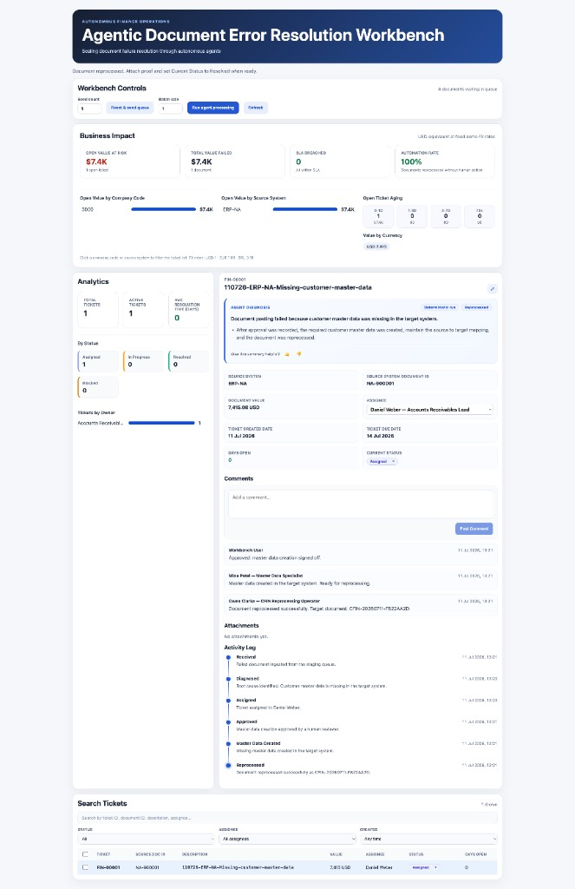
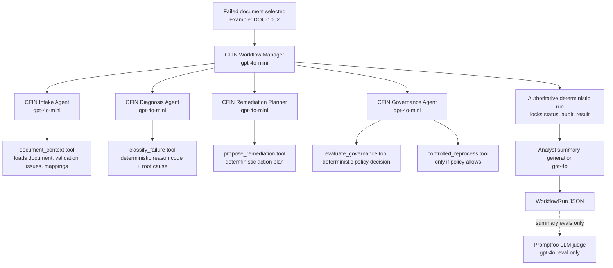
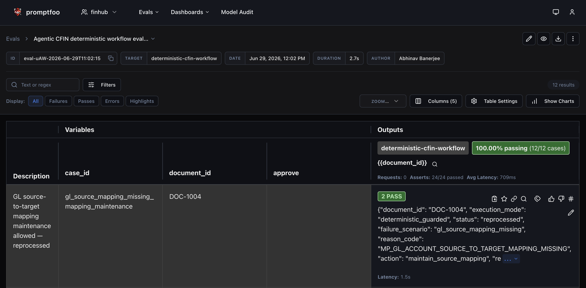
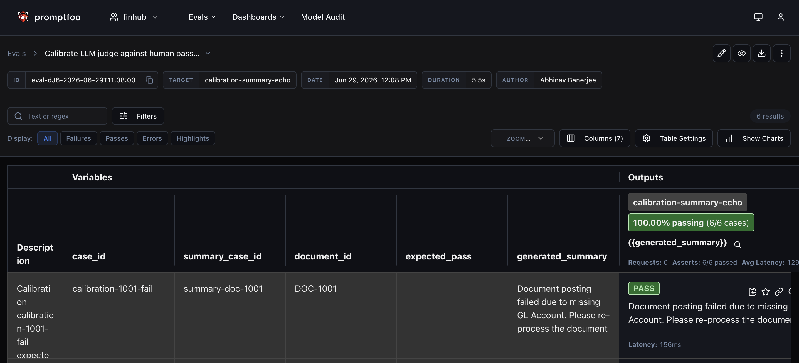
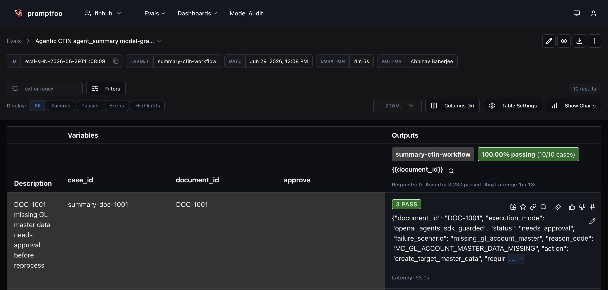

# FinHub - Agentic Document Resolution Workbench

**FinHub - Agentic Document Resolution Workbench** is a vendor-neutral Agentic AI prototype inspired by SAP Central Finance failed-document replication. It uses synthetic finance data and mock enterprise systems to show how agents can diagnose, govern, and resolve failed finance documents safely.

For the business case and design narrative, see [`finhub.md`](finhub.md).

## Introduction

The primary demo surface is the React **workbench** — a single-screen operations console where finance analysts triage failed documents after autonomous agents have already run. Seed the queue, run agent processing, inspect diagnoses, update ticket status, attach proof, and jump to Langfuse traces — no terminal required.

**Live app:** [https://scalefinhub.up.railway.app/](https://scalefinhub.up.railway.app/)



**Demo loop:**

```text
Reset & seed queue  →  Run agent processing  →  Triage tickets  →  View trace in Langfuse
```

| UI area | Purpose |
|---------|---------|
| **Workbench Controls** | Seed count, reset queue, sweep batch size, refresh |
| **Analytics** | Total/active tickets, status breakdown, owner chart |
| **Ticket detail** | Agent diagnosis hero, policy context, comments, proof uploads, activity log, **View trace in Langfuse** (when configured) |
| **Search Tickets** | Filter and update `operator_status` inline |

Operator statuses: **Assigned**, **In Progress**, **Blocked** (requires comment), **Resolved** (requires proof attachment). Agent policy outcomes (`needs_approval`, `blocked`, etc.) live in `workflow_run` and the diagnosis summary — not as separate status pills.

Architecture details: [`docs/ARCHITECTURE.md`](docs/ARCHITECTURE.md).

## What It Demonstrates

- React + FastAPI **document resolution workbench** for triage — self-contained demo loop (seed, agent processing, refresh) with no terminal dependency.
- Durable runtime state via SQLite + configurable attachment storage (`FINHUB_DATA_DIR`, optional S3).
- Multi-agent orchestration with all operational agents on `gpt-4o-mini`; analyst summaries use `gpt-4o`.
- Promptfoo evals for deterministic workflow guardrails and model-graded analyst summaries.
- Langfuse/OpenTelemetry observability when credentials are configured.
- GitHub Actions CI for deterministic evals; optional manual summary eval workflow.

## Local Setup

```bash
uv sync
cp .env.example .env
bash scripts/dev-workbench.sh   # backend on :8000, frontend on :5173
```

The app works in deterministic mode without API keys. Set `OPENAI_API_KEY` to enable the OpenAI Agents SDK orchestration path (default when configured). Operational agents use `OPENAI_MODEL=gpt-4o-mini`; set `SUMMARY_USE_LLM=1` and `SUMMARY_MODEL=gpt-4o` to persist LLM-generated analyst summaries on workbench tickets. Set Langfuse variables to export traces.

## Deploy to Railway (production)

FinHub ships as a **multi-stage Docker** image (`Dockerfile` + `railway.json`). One container serves the React workbench and FastAPI API on Railway's `$PORT`. Eval scripts run **locally or in GitHub Actions only** — not on Railway.

Full walkthrough: [`DEPLOYMENT.md`](DEPLOYMENT.md).

### Quick deploy checklist

1. **Railway** → **New Project** → **Deploy from GitHub repo** → select this repo (`main`).
2. Wait for the **Docker build** to succeed (Node 22 frontend build → Python 3.11/uv runtime).
3. **Variables** tab — set at minimum:

   | Variable | Value |
   |----------|--------|
   | `OPENAI_API_KEY` | your OpenAI key |
   | `SUMMARY_USE_LLM` | `1` |
   | `SUMMARY_MODEL` | e.g. `gpt-4o` |
   | `FINHUB_DATA_DIR` | `/data/finhub` *(after volume step)* |
   | `RAILWAY_RUN_UID` | `0` *(recommended with Docker + volumes)* |

   Optional: `OPENAI_MODEL` (defaults to `gpt-4o-mini`), `LANGFUSE_PUBLIC_KEY`, `LANGFUSE_SECRET_KEY`, `LANGFUSE_BASE_URL`.

4. **Persistent storage** — on the project canvas, press **`⌘K`** (or **`Ctrl+K`**) → **Create Volume** → attach to your service → mount path **`/data`**. Then set `FINHUB_DATA_DIR=/data/finhub` and redeploy.  
   *(Railway volumes are created from the command palette or right-click menu — not under Settings → Volumes.)*

5. **Settings → Networking → Generate Domain** — open the public URL.

6. **Verify** — visit `https://<your-domain>/api/health` (expect `"status": "ok"`) then run the workbench demo loop below.

### Production demo loop

Same as local, no terminal required:

```text
Reset & seed queue  →  Run agent processing  →  Triage tickets  →  View trace in Langfuse
```

### Local vs production

| | Local dev | Railway (production) |
|---|-----------|----------------------|
| Start | `bash scripts/dev-workbench.sh` | Auto-starts via Docker `CMD` |
| UI | `http://localhost:5173` (Vite) | Your Railway domain (root URL) |
| API | `:8000` (proxied by Vite) | Same origin `/api` on one port |
| Data | `data/synthetic/` by default | `FINHUB_DATA_DIR` on mounted volume |
| Build | Two processes | Single Docker image (`frontend/dist` baked in) |

### Docker build (how Railway builds this repo)

```text
Stage 1 (node:22)     npm ci + vite build  →  frontend/dist
Stage 2 (python:3.11) uv sync --frozen     →  copy dist, run cfin-api
```

To reproduce the production image locally (requires Docker):

```bash
docker build -t finhub .
docker run --rm -p 8000:8000 -e OPENAI_API_KEY=sk-... -e SUMMARY_USE_LLM=1 finhub
# open http://127.0.0.1:8000
```

## CLI Commands

| Command | Agentic? | Purpose |
|---------|----------|---------|
| `uv run cfin-demo DOC-1002 [--approve] [--deterministic]` | Yes (default if key set) | Single-document workflow → JSON `WorkflowRun` |
| `uv run cfin-seed [--count 50] [--reset \| --clear-only]` | — | Seed or clear the SQLite staging queue |
| `uv run cfin-sweep [--batch-size 5]` | Yes | Claim `NEW` staging rows → agentic workflow → tickets |
| `uv run cfin-api` | — | FastAPI server (workbench API + production static UI) |
| `uv run cfin-batch-demo [--count 50]` | **No** | Legacy: seed + **deterministic** diagnose (strips API key during run) |
| `uv run cfin-refresh-summaries [--dry-run] [--clear-first]` | Uses summary path | Regenerate or clear persisted `agent_summary` on existing tickets |

The **workbench UI** (`Reset & seed` / `Run agent processing`) is the recommended demo path. CLI seed/sweep are equivalent automation hooks.

## Environment Variables

- `OPENAI_API_KEY`: enables OpenAI Agents SDK execution and analyst summary generation.
- `OPENAI_MODEL`: model for agent orchestration, defaults to `gpt-4o-mini`.
- `SUMMARY_MODEL`: model for `agent_summary` generation, defaults to `gpt-4o`.
- `SUMMARY_USE_LLM`: set to `1` to generate and persist LLM analyst summaries on tickets (recommended for demos).
- `SUMMARY_JUDGE_MODEL`: model for Promptfoo LLM judge evals, defaults to `gpt-4o` (evals only).
- `DISABLE_LLM`: set to `1` to force deterministic execution (no agent orchestration).
- `FINHUB_DATA_DIR`: directory for SQLite DB and local attachments (default: `data/synthetic`; on Railway use `/data/finhub` with a mounted volume).
- `RAILWAY_RUN_UID`: set to `0` on Railway when using Docker + volumes (Railway-only; not in local `.env`).
- `STORAGE_BACKEND`: `local` (default) or `s3` for attachment blob storage.
- `S3_BUCKET`, `S3_ENDPOINT_URL`, `S3_ACCESS_KEY_ID`, `S3_SECRET_ACCESS_KEY`, `S3_REGION`, `S3_PREFIX`: S3-compatible storage when `STORAGE_BACKEND=s3`.
- `LANGFUSE_PUBLIC_KEY`, `LANGFUSE_SECRET_KEY`: Langfuse observability (optional).
- `LANGFUSE_HOST` or `LANGFUSE_BASE_URL`: Langfuse host, e.g. `https://cloud.langfuse.com` (either name works).
- `API_HOST`, `API_PORT`, `API_RELOAD`: local API server tuning (`PORT` is set automatically on Railway).
- `VITE_API_BASE`: optional frontend API override (default: same-origin `/api` in dev and production).

See [`.env.example`](.env.example) for the full template.

## Multi-Agent Workflow

By default, when `OPENAI_API_KEY` is configured and `DISABLE_LLM=0`, the prototype runs through the OpenAI Agents SDK. The agents coordinate the work, but the actual finance decisions still come from deterministic guarded services. This keeps the demo agentic while preserving predictable policy outcomes.

### Agents and Models

| Component | Model | Purpose |
|-----------|-------|---------|
| `CFIN Workflow Manager` | `OPENAI_MODEL` (`gpt-4o-mini`) | Coordinates the specialist agents in the correct order. |
| `CFIN Intake Agent` | `OPENAI_MODEL` (`gpt-4o-mini`) | Collects the failed document, validation issues, and available mappings. |
| `CFIN Diagnosis Agent` | `OPENAI_MODEL` (`gpt-4o-mini`) | Calls the deterministic classifier to identify reason code and root cause. |
| `CFIN Remediation Planner` | `OPENAI_MODEL` (`gpt-4o-mini`) | Calls the planner to propose the next remediation action. |
| `CFIN Governance Agent` | `OPENAI_MODEL` (`gpt-4o-mini`) | Calls policy checks and reprocesses only when guardrails allow it. |
| Analyst summary writer | `SUMMARY_MODEL` (`gpt-4o`) | Writes the final 2-3 sentence finance analyst summary shown on workbench tickets. |
| LLM judge | `SUMMARY_JUDGE_MODEL` (`gpt-4o`) | Scores summaries during Promptfoo evals only. Not part of normal workflow execution. |

### End-to-End Flow



### Example: `DOC-1002`

`DOC-1002` is ingested from the synthetic failed-document queue. The Intake Agent calls `document_context`, which loads the source document, checks target validation issues, and returns the available mappings.

The Diagnosis Agent calls `classify_failure`. The deterministic classifier returns `MP_COST_CENTER_SOURCE_TO_TARGET_MAPPING_MISSING`, meaning the target cost center master data exists but the source-to-target mapping is missing.

The Remediation Planner calls `propose_remediation`. It proposes `maintain_source_mapping`: the analyst should manually maintain the missing mapping entry in the target mapping table, then reprocess the document. No approval is required for this mapping-maintenance case.

The Governance Agent calls `evaluate_governance`. The policy engine allows the case to proceed because it is a mapping-maintenance issue, not master-data creation and not a closed posting period. It then calls `controlled_reprocess`, which simulates reprocessing under the policy guardrails.

Finally, the deterministic workflow runs as the authoritative final pass and records status, reason code, action, reprocess result, and audit events. `generate_analyst_summary()` then writes the analyst-facing explanation — an LLM summary via `SUMMARY_MODEL=gpt-4o` when `SUMMARY_USE_LLM=1`, or eval-aligned deterministic text otherwise. Example:

```text
Document posting failed because the cost center source-to-target mapping is missing. Maintain the missing mapping entry manually in the target mapping table, then reprocess the document. No approval is required.
```

## Observability (Langfuse)

Each agentic workflow run can export a full audit trail to [Langfuse](https://langfuse.com) via OpenTelemetry. This makes the demo inspectable: you can see which tools ran, what policy decided, and which models were used — without reading raw JSON logs.

### Setup

Add to `.env` (local) or Railway **Variables**:

```bash
LANGFUSE_PUBLIC_KEY=pk-lf-...
LANGFUSE_SECRET_KEY=sk-lf-...
LANGFUSE_BASE_URL=https://cloud.langfuse.com   # or LANGFUSE_HOST
```

After redeploy, run **Run agent processing** on a ticket, then open **View trace in Langfuse** on the ticket detail page. Health endpoints report connectivity: `GET /api/health`, `GET /api/workbench/status`.

Implementation: [`src/cfin_agents/observability.py`](src/cfin_agents/observability.py) (`workflow_observation`, `summary_generation_observation`, OpenInference OTLP export).

### What gets traced

| Trace element | Model / source | Purpose |
|---------------|----------------|---------|
| Root span `agentic-cfin-workflow` | — | One trace per document run; `session_id=document-{id}`; tags `cfin`, `agentic-workflow` |
| Agent SDK spans (`intake_document`, `diagnose_document`, …) | `OPENAI_MODEL` (`gpt-4o-mini`) | Orchestration — which tool to call next |
| Tool outputs (`classify_failure`, `evaluate_governance`, …) | Deterministic Python services | **Source of truth** for reason codes, policy, allow/block |
| Generation `analyst-summary` | `SUMMARY_MODEL` (`gpt-4o`) | Plain-English text shown on the workbench ticket (~1s) |

Trace IDs are stored on `WorkflowRun.langfuse_trace_id` and linked from ticket detail.

**Design principle:** agents coordinate and explain; **deterministic tools** decide outcomes. Langfuse shows both layers side by side.

### Example trace walkthrough

Real run from the workbench queue (full write-up: [`docs/LANGFUSE-TRACE-EXAMPLE.md`](docs/LANGFUSE-TRACE-EXAMPLE.md), raw export: [`docs/trace-b268da541f455e73279bf2bda22fb7c6.json`](docs/trace-b268da541f455e73279bf2bda22fb7c6.json)).

| | |
|---|---|
| **Trace ID** | `b268da541f455e73279bf2bda22fb7c6` |
| **Document** | `DOC-GEN-00001` |
| **Session** | `document-DOC-GEN-00001` |
| **Duration** | ~30 seconds |
| **Outcome** | `needs_approval` — document **not** reprocessed |

**What happened:**

1. A failed customer document landed in the queue (`approve: false` — no human approval on record).
2. The **Workflow Manager** (`gpt-4o-mini`) ran four turns: **intake → diagnose → plan → govern**.
3. Deterministic tools classified the root cause as **missing customer master data** (`MD_CUSTOMER_MASTER_DATA_MISSING`) and proposed creating target master data.
4. **Policy blocked reprocessing** — creating master data requires human approval first (`needs_approval`, `allowed: false`).
5. A separate **`analyst-summary`** call (`gpt-4o`, ~1s) wrote the ticket text:

   > Document posting failed due to missing customer master data in the target system. Approval is required before creating the target master data. Once approved, maintain the source-to-target mapping and reprocess the document.

```text
agentic-cfin-workflow                    ← root span (~30s)
├── CFIN Workflow Manager (gpt-4o-mini)
│   ├── intake_document
│   ├── diagnose_document      → MD_CUSTOMER_MASTER_DATA_MISSING
│   ├── plan_remediation       → create_target_master_data
│   └── govern_and_reprocess   → needs_approval (blocked)
└── analyst-summary (gpt-4o)   ← ticket text for the analyst
```

#### Trace overview (Langfuse UI)

Collapsed view of the same trace — four agent turns plus `analyst-summary`:


#### Cost and model split

One workflow run = **1 trace**, **45 observations**, **~$0.003** total — mostly `gpt-4o-mini` for orchestration, smaller `gpt-4o` cost for the analyst summary:


**Takeaway:** two models, two jobs — `gpt-4o-mini` orchestrates; `gpt-4o` writes the analyst-facing summary; policy tools gate reprocessing regardless of what the agent planned.

## CLI Smoke Checks

```bash
uv run cfin-demo DOC-1002
uv run cfin-demo DOC-1001 --approve
uv run cfin-demo DOC-1004
```

Expected outcomes:

- `DOC-1002`: mapping issue — analyst manually maintains missing cost center source-to-target mapping, then reprocesses (`MP_COST_CENTER_SOURCE_TO_TARGET_MAPPING_MISSING`).
- `DOC-1001 --approve`: human-approved — GL account master data created and reprocessed (`MD_GL_ACCOUNT_MASTER_DATA_MISSING`).
- `DOC-1004`: mapping issue — analyst manually maintains missing GL account source-to-target mapping, then reprocesses (`MP_GL_ACCOUNT_SOURCE_TO_TARGET_MAPPING_MISSING`).

## Promptfoo (automated regression evals)

[Promptfoo](https://www.promptfoo.dev/) turns golden YAML test cases into repeatable regression runs with a pass/fail UI. Human grading (Excel rubric + calibration) defined what “good” looks like; Promptfoo automates that loop. Methodology: [`promptfoo.md`](promptfoo.md).

### How to run evals

**One-time setup:**

```bash
uv sync
cp .env.example .env    # add OPENAI_API_KEY only for summary evals (step 2)
```

**Run in order:**

| Step | Command | API key? | Pass criteria |
|------|---------|----------|---------------|
| **1 — Deterministic** | `bash scripts/run_deterministic_evals.sh` | No | 12/12 workflow cases (pytest + Promptfoo) |
| **2 — Summary** | `bash scripts/run_summary_evals.sh` | Yes | 6/6 calibration, then 10/10 live summary judge |

Step 2 runs **calibration first**, then the live 10-doc judge, and logs results to `evals/model_outputs.jsonl`. To run calibration only: `bash scripts/run_summary_calibration.sh`.

**View results:**

```bash
bash scripts/promptfoo_view.sh
```

Always use this script — not bare `npx promptfoo view`. FinHub stores runs in **`.promptfoo/`** (project-local); the global viewer may show a different project.

**Optional — Promptfoo cloud:** Add `PROMPTFOO_API_KEY` to `.env`, then set `PROMPTFOO_SHARE=1` to auto-upload each run, or run `bash scripts/promptfoo_share_latest.sh` after a local run.

CI runs step 1 on every push/PR; step 2 is manual. See [`CI.md`](CI.md).

### What each suite checks

| Suite | Cases | What it checks |
|-------|-------|----------------|
| **Deterministic workflow** | 12 | Exact `status`, `reason_code`, `action`, policy allow/block (`DISABLE_LLM=1`) |
| **Summary judge calibration** | 6 | LLM judge agrees with human pass/fail on fixed good/bad summaries |
| **Summary live + judge** | 10 | Live agentic workflow → `agent_summary` → judge scores accuracy + actionability (both ≥ 4) |

Golden sources: `evals/deterministic_cases.yaml` and `evals/summary_cases.yaml` (shared with pytest).

### How each suite works (inner layers)

Each Promptfoo row shows a **PASS badge count** equal to the number of assertions on that row — not the total document count across the suite.

#### 1. Deterministic workflow eval (12 cases · **2 PASS** per row · 24 asserts total)



**Purpose:** Prove that policy guardrails and structured workflow outcomes are unchanged — independent of LLM orchestration. Runs with `DISABLE_LLM=1` so every case uses `DeterministicWorkflow` only.

**Config:** `evals/promptfooconfig.yaml` · **Provider:** `deterministic-cfin-workflow` (`evals/provider.py`) · **Golden source:** `evals/deterministic_cases.yaml` (shared with pytest)

**Per-document pipeline:**

```text
document_id (vars)  →  provider runs DeterministicWorkflow  →  JSON WorkflowRun  →  2 assertions
```

| Layer | Assertion | What it checks |
|-------|-----------|----------------|
| **1 — Parse** | `contains-json` | Provider output is valid JSON (catches crashes, empty responses, malformed payloads). |
| **2 — Outcome** | `expect_document_outcome` (`evals/assertions.py`) | Exact match against golden expectations: `status`, `failure_scenario`, `reason_code`, `action`, `requires_approval`, `allowed`, `reprocessed`. |

Example row (`DOC-1004`, GL mapping maintenance): output shows `status: reprocessed`, `reason_code: MP_GL_ACCOUNT_SOURCE_TO_TARGET_MAPPING_MISSING`, `action: maintain_source_mapping` — both layers PASS → **2 PASS**.

---

#### 2. Summary judge calibration (6 cases · **1 PASS** per row · 6 asserts total)



**Purpose:** Validate the LLM judge *before* trusting it on live summaries. Uses **fixed** good and bad analyst text (human-labeled pass/fail in the workbook) — **not** a live workflow run.

**Config:** `evals/promptfoo_summary_calibration_config.yaml` · **Provider:** `calibration-summary-echo` (echoes `{{generated_summary}}` back unchanged) · **Cases:** `evals/summary_calibration_generate_tests.py`

**Per-case pipeline:**

```text
generated_summary + expected_pass (vars)  →  echo provider  →  expect_calibration_judge
```

| Layer | Assertion | What it checks |
|-------|-----------|----------------|
| **1 — Judge alignment** | `expect_calibration_judge` (`evals/summary_assertions.py`) | Calls `grade_agent_summary()` (same judge as live evals). Compares judge pass/fail to the human `expected_pass` label. Fails if the judge disagrees with the human grader. |

Inside the judge: `SUMMARY_JUDGE_MODEL` (default `gpt-4o`) scores **accuracy** and **actionability** on a 1–5 rubric. **Dual gate:** both must be ≥ 4 for judge pass. Calibration also records audience fit and conciseness for debugging, but only accuracy + actionability gate pass/fail.

Example fail case (`calibration-1001-fail`): summary says "missing GL Account" instead of the correct master-data root cause — judge should fail, matching human label → **1 PASS**.

---

#### 3. Summary live + judge (10 cases · **3 PASS** per row · 30 asserts total)



**Purpose:** End-to-end regression on real agentic runs — structured workflow **and** analyst-facing `agent_summary` quality — for all 10 synthetic failure scenarios.

**Config:** `evals/promptfoo_summary_config.yaml` · **Provider:** `summary-cfin-workflow` (`evals/summary_provider.py`) · **Golden source:** `evals/summary_cases.yaml`

**Per-document pipeline:**

```text
document_id  →  full AgenticWorkflow (gpt-4o-mini agents + deterministic tools)
             →  generate_analyst_summary (SUMMARY_MODEL, gpt-4o)
             →  JSON WorkflowRun with agent_summary  →  3 assertions
```

| Layer | Assertion | What it checks |
|-------|-----------|----------------|
| **1 — Parse** | `contains-json` | Live workflow returned parseable JSON. |
| **2 — Smoke** | `expect_summary_smoke` | Structured fields match golden: `status`, `reason_code`, `action`; `agent_summary` is present and non-empty. Does **not** judge wording — only that the pipeline produced the right policy outcome and a summary exists. |
| **3 — Judge** | `expect_summary_judge` | LLM judge grades the `agent_summary` text against golden truth from `summary_cases.yaml`. Pass requires accuracy ≥ 4 **and** actionability ≥ 4 (same rubric as calibration). |

Example row (`DOC-1001`, missing GL master data): output shows `status: needs_approval`, `reason_code: MD_GL_ACCOUNT_MASTER_DATA_MISSING`, `action: create_target_master_data`, plus a 2–3 sentence analyst summary — all three layers PASS → **3 PASS**.

Results are also appended to `evals/model_outputs.jsonl` for offline review and optional Excel export.

---

#### Eval flow (recommended order)

```text
Step 1: bash scripts/run_deterministic_evals.sh     (no API key)
        │
        ▼
Step 2: bash scripts/run_summary_evals.sh           (OPENAI_API_KEY in .env)
        │   ├── calibration (6 cases)
        │   └── live summary + judge (10 cases)
        │
        ▼
View:   bash scripts/promptfoo_view.sh
```

## Evals

This project has three eval suites (see **Promptfoo** section above for screenshots, inner layers, and commands):

1. **Deterministic evals** — exact checks on workflow status, reason code, action, and policy outcomes (12 cases, no API key).
2. **Summary judge calibration** — LLM judge aligned to human pass/fail labels on fixed summaries (6 cases).
3. **Summary live evals** — model-graded checks on live `agent_summary` text after full agentic workflow (10 cases).

Human labels for the original 3 starter docs (DOC-1001, DOC-1002, DOC-1006) live in `AI Evals_SM5_v0.6.xlsx` (golden dataset + rubric + calibration rows). The **automation source of truth** for summary evals is `evals/summary_cases.yaml`, which now covers all **10** synthetic failure scenarios. The 7 additional YAML rows follow the same three policy patterns (missing master data, missing mapping, closed period) and were validated by the LLM judge; they are not yet duplicated in Excel unless you extend the workbook manually.

See [`promptfoo.md`](promptfoo.md) for a beginner-friendly explanation of how manual grading connects to Promptfoo automation.

### Golden dataset (10 summary eval cases)

All cases run with `approve: false` unless noted. See `evals/summary_cases.yaml` for full `must_mention`, `must_not_say`, and example summaries.

| Doc | Policy shape | Failure scenario | Expected status | Reason code |
|-----|--------------|------------------|-----------------|-------------|
| DOC-1001 | Missing master data | GL account master data missing | `needs_approval` | `MD_GL_ACCOUNT_MASTER_DATA_MISSING` |
| DOC-1002 | Missing mapping | Cost center source→target mapping missing | `reprocessed` | `MP_COST_CENTER_SOURCE_TO_TARGET_MAPPING_MISSING` |
| DOC-1003 | Missing master data | Vendor master data missing | `needs_approval` | `MD_VENDOR_MASTER_DATA_MISSING` |
| DOC-1004 | Missing mapping | GL account source→target mapping missing | `reprocessed` | `MP_GL_ACCOUNT_SOURCE_TO_TARGET_MAPPING_MISSING` |
| DOC-1005 | Missing master data | Cost center master data missing | `needs_approval` | `MD_COST_CENTER_MASTER_DATA_MISSING` |
| DOC-1006 | Closed period | Posting period closed | `blocked` | `DC_POSTING_PERIOD_CLOSED` |
| DOC-1007 | Missing mapping | Profit center source→target mapping missing | `reprocessed` | `MP_PROFIT_CENTER_SOURCE_TO_TARGET_MAPPING_MISSING` |
| DOC-1008 | Missing master data | Profit center master data missing | `needs_approval` | `MD_PROFIT_CENTER_MASTER_DATA_MISSING` |
| DOC-1009 | Missing master data | Customer master data missing | `needs_approval` | `MD_CUSTOMER_MASTER_DATA_MISSING` |
| DOC-1010 | Missing master data | Asset master data missing | `needs_approval` | `MD_ASSET_MASTER_DATA_MISSING` |

**Provenance:** DOC-1001, DOC-1002, and DOC-1006 were human-labeled in Excel v0.6. DOC-1003–1005 and DOC-1007–1010 were added to YAML by cloning those three patterns per entity type.

**Deterministic evals** use a separate 12-case matrix in `evals/deterministic_cases.yaml` (includes approved variants such as DOC-1001 with `--approve` that are not in the summary golden set).

### Deterministic Evals

Run via **step 1** above (`bash scripts/run_deterministic_evals.sh`). That script runs pytest, a workflow smoke check, and Promptfoo over `evals/deterministic_cases.yaml`.

To add a new scenario, update `evals/deterministic_cases.yaml` once — pytest and Promptfoo pick it up automatically.

### Summary Evals (Model-Graded)

Run via **step 2** above (`bash scripts/run_summary_evals.sh`). Requires `OPENAI_API_KEY` in `.env`; summaries use `SUMMARY_MODEL` (`gpt-4o` by default).

The LLM judge enforces the dual gate: accuracy ≥ 4 **and** actionability ≥ 4.

**Advanced (optional):**

```bash
bash scripts/run_summary_eval_batch.sh   # programmatic batch + JSONL log only
uv run python scripts/log_summary_eval_results.py --excel "AI Evals_SM5_v0.6.xlsx"   # Excel export (needs uv sync --group dev)
```

See [`Evals-Journey.md`](Evals-Journey.md) for the session log and methodology decisions.

## Documentation

| Doc | Purpose |
|-----|---------|
| [`README.md`](README.md) | Setup, workflow, evals, deployment (start here) |
| [`docs/ARCHITECTURE.md`](docs/ARCHITECTURE.md) | System architecture, data model, API, persistence |
| [`docs/LANGFUSE-TRACE-EXAMPLE.md`](docs/LANGFUSE-TRACE-EXAMPLE.md) | Plain-English walkthrough of a sample Langfuse trace |
| [`finhub.md`](finhub.md) | Business context and scope |
| [`Evals-Journey.md`](Evals-Journey.md) | Eval methodology, session log, concepts guide |
| [`promptfoo.md`](promptfoo.md) | Manual grading → Promptfoo automation (detailed) |
| [`CI.md`](CI.md) | CI vs local test scripts |
| [`DEPLOYMENT.md`](DEPLOYMENT.md) | Railway deployment |

### CI

See [`CI.md`](CI.md) for a plain-language guide: what CI is, what runs automatically vs manually, and when to run `run_deterministic_evals.sh` vs `run_summary_evals.sh` locally.

Short version: GitHub Actions runs lint + deterministic evals on every push/PR; summary evals run only when you trigger them manually (requires `OPENAI_API_KEY` secret).
