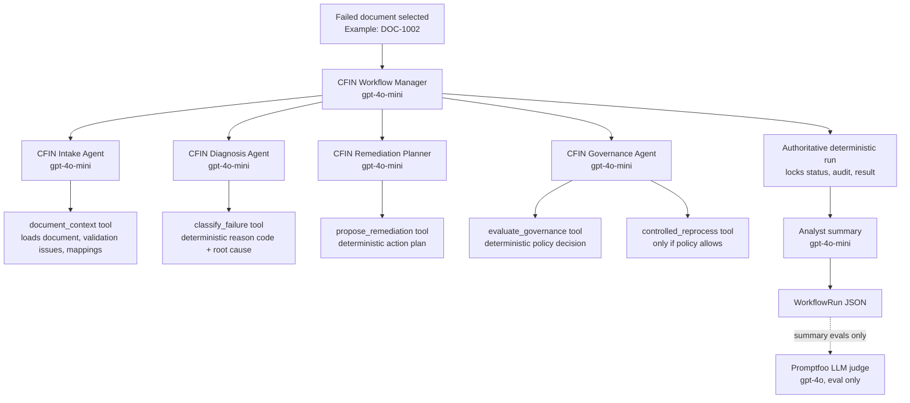

# Agentic CFIN Workflow Prototype (FinHub)

This project (**FinHub**) is a vendor-neutral Agentic AI prototype inspired by SAP Central Finance failed-document replication. It uses synthetic finance data and mock enterprise systems to test whether agents can diagnose, govern, and reprocess failed finance documents safely.

For the business case and design narrative, see [`finhub.md`](finhub.md).

## What It Demonstrates

- Synthetic Central Finance-style failed document queue.
- Deterministic validation, remediation, approval, policy, audit, and reprocessing services.
- Optional OpenAI Agents SDK orchestration over the deterministic tools.
- Langfuse/OpenTelemetry observability when credentials are configured.
- Promptfoo evals for deterministic workflow guardrails and model-graded analyst summaries.
- Streamlit dashboard with workflow + eval results pages, suitable for Railway deployment.
- GitHub Actions CI for deterministic evals; optional manual summary eval workflow.

## Local Setup

```bash
uv sync
cp .env.example .env
uv run streamlit run app/streamlit_app.py
```

The app works in deterministic mode without API keys. Set `OPENAI_API_KEY` to enable the OpenAI Agents SDK orchestration path (default when configured). Set Langfuse variables to export traces.

## Environment Variables

- `OPENAI_API_KEY`: enables OpenAI Agents SDK execution and analyst summary generation.
- `OPENAI_MODEL`: model for agent orchestration, defaults to `gpt-4o-mini`.
- `SUMMARY_MODEL`: model for `agent_summary` generation, defaults to `gpt-4o-mini`.
- `SUMMARY_JUDGE_MODEL`: model for Promptfoo LLM judge evals, defaults to `gpt-4o`.
- `DISABLE_LLM`: set to `1` to force deterministic execution (no agent orchestration).
- `LANGFUSE_PUBLIC_KEY`: Langfuse public key.
- `LANGFUSE_SECRET_KEY`: Langfuse secret key.
- `LANGFUSE_HOST`: Langfuse host, for example `https://cloud.langfuse.com`.

## Multi-Agent Workflow

By default, when `OPENAI_API_KEY` is configured and `DISABLE_LLM=0`, the prototype runs through the OpenAI Agents SDK. The agents coordinate the work, but the actual finance decisions still come from deterministic guarded services. This keeps the demo agentic while preserving predictable policy outcomes.

### Agents and Models

| Component | Model | Purpose |
|-----------|-------|---------|
| `CFIN Workflow Manager` | `OPENAI_MODEL` (`gpt-4o-mini`) | Coordinates the specialist agents in the correct order. |
| `CFIN Intake Agent` | `OPENAI_MODEL` (`gpt-4o-mini`) | Collects the failed document, validation issues, and available mappings. |
| `CFIN Diagnosis Agent` | `OPENAI_MODEL` (`gpt-4o-mini`) | Calls the deterministic classifier to identify reason code and root cause. |
| `CFIN Remediation Planner` | `OPENAI_MODEL` (`gpt-4o-mini`) | Calls the planner to propose the next remediation action. |
| `CFIN Governance Agent` | `OPENAI_MODEL` (`gpt-4o-mini`) | Calls policy checks and reprocesses only when guardrails allow it. |
| Analyst summary writer | `SUMMARY_MODEL` (`gpt-4o-mini`) | Writes the final 2-3 sentence finance analyst summary. |
| LLM judge | `SUMMARY_JUDGE_MODEL` (`gpt-4o`) | Scores summaries during Promptfoo evals only. Not part of normal workflow execution. |

### End-to-End Flow



### Example: `DOC-1002`

`DOC-1002` is ingested from the synthetic failed-document queue. The Intake Agent calls `document_context`, which loads the source document, checks target validation issues, and returns the available mappings.

The Diagnosis Agent calls `classify_failure`. The deterministic classifier returns `MP_COST_CENTER_SOURCE_TO_TARGET_MAPPING_MISSING`, meaning the target cost center master data exists but the source-to-target mapping is missing.

The Remediation Planner calls `propose_remediation`. It proposes `maintain_source_mapping`: the analyst should manually maintain the missing mapping entry in the target mapping table, then reprocess the document. No approval is required for this mapping-maintenance case.

The Governance Agent calls `evaluate_governance`. The policy engine allows the case to proceed because it is a mapping-maintenance issue, not master-data creation and not a closed posting period. It then calls `controlled_reprocess`, which simulates reprocessing under the policy guardrails.

Finally, the deterministic workflow runs as the authoritative final pass and records status, reason code, action, reprocess result, and audit events. `generate_analyst_summary()` then uses `SUMMARY_MODEL` (`gpt-4o-mini`) to write a short analyst-facing explanation, for example:

```text
Document posting failed because the cost center source-to-target mapping is missing. Maintain the missing mapping entry manually in the target mapping table, then reprocess the document. No approval is required.
```

## CLI Smoke Checks

```bash
uv run cfin-demo DOC-1002
uv run cfin-demo DOC-1001 --approve
uv run cfin-demo DOC-1004
```

Expected outcomes:

- `DOC-1002`: mapping issue — analyst manually maintains missing cost center source-to-target mapping, then reprocesses (`MP_COST_CENTER_SOURCE_TO_TARGET_MAPPING_MISSING`).
- `DOC-1001 --approve`: human-approved — GL account master data created and reprocessed (`MD_GL_ACCOUNT_MASTER_DATA_MISSING`).
- `DOC-1004`: mapping issue — analyst manually maintains missing GL account source-to-target mapping, then reprocesses (`MP_GL_ACCOUNT_SOURCE_TO_TARGET_MAPPING_MISSING`).

## Evals

This project has two eval layers:

1. **Deterministic evals** — exact checks on workflow status, reason code, action, and policy outcomes.
2. **Summary evals** — model-graded checks on the plain-English `agent_summary` for finance analysts.

Human labels for the original 3 starter docs (DOC-1001, DOC-1002, DOC-1006) live in `AI Evals_SM5_v0.6.xlsx` (golden dataset + rubric + calibration rows). The **automation source of truth** for summary evals is `evals/summary_cases.yaml`, which now covers all **10** synthetic failure scenarios. The 7 additional YAML rows follow the same three policy patterns (missing master data, missing mapping, closed period) and were validated by the LLM judge; they are not yet duplicated in Excel unless you extend the workbook manually.

See [`promptfoo.md`](promptfoo.md) for a beginner-friendly explanation of how manual grading connects to Promptfoo automation.

### Golden dataset (10 summary eval cases)

All cases run with `approve: false` unless noted. See `evals/summary_cases.yaml` for full `must_mention`, `must_not_say`, and example summaries.

| Doc | Policy shape | Failure scenario | Expected status | Reason code |
|-----|--------------|------------------|-----------------|-------------|
| DOC-1001 | Missing master data | GL account master data missing | `needs_approval` | `MD_GL_ACCOUNT_MASTER_DATA_MISSING` |
| DOC-1002 | Missing mapping | Cost center source→target mapping missing | `reprocessed` | `MP_COST_CENTER_SOURCE_TO_TARGET_MAPPING_MISSING` |
| DOC-1003 | Missing master data | Vendor master data missing | `needs_approval` | `MD_VENDOR_MASTER_DATA_MISSING` |
| DOC-1004 | Missing mapping | GL account source→target mapping missing | `reprocessed` | `MP_GL_ACCOUNT_SOURCE_TO_TARGET_MAPPING_MISSING` |
| DOC-1005 | Missing master data | Cost center master data missing | `needs_approval` | `MD_COST_CENTER_MASTER_DATA_MISSING` |
| DOC-1006 | Closed period | Posting period closed | `blocked` | `DC_POSTING_PERIOD_CLOSED` |
| DOC-1007 | Missing mapping | Profit center source→target mapping missing | `reprocessed` | `MP_PROFIT_CENTER_SOURCE_TO_TARGET_MAPPING_MISSING` |
| DOC-1008 | Missing master data | Profit center master data missing | `needs_approval` | `MD_PROFIT_CENTER_MASTER_DATA_MISSING` |
| DOC-1009 | Missing master data | Customer master data missing | `needs_approval` | `MD_CUSTOMER_MASTER_DATA_MISSING` |
| DOC-1010 | Missing master data | Asset master data missing | `needs_approval` | `MD_ASSET_MASTER_DATA_MISSING` |

**Provenance:** DOC-1001, DOC-1002, and DOC-1006 were human-labeled in Excel v0.6. DOC-1003–1005 and DOC-1007–1010 were added to YAML by cloning those three patterns per entity type.

**Deterministic evals** use a separate 12-case matrix in `evals/deterministic_cases.yaml` (includes approved variants such as DOC-1001 with `--approve` that are not in the summary golden set).

### Deterministic Evals

Run the deterministic suite first:

```bash
bash scripts/run_deterministic_evals.sh
```

This runs:

- pytest over the shared case matrix in `evals/deterministic_cases.yaml`
- service-level policy/validator unit tests
- the workflow smoke check
- Promptfoo deterministic evals generated from the same case matrix

To add a new deterministic scenario, update `evals/deterministic_cases.yaml` once. Both pytest and Promptfoo will pick it up automatically.

Deterministic Promptfoo config:

```bash
PROMPTFOO_CONFIG_DIR=.promptfoo \
PROMPTFOO_DISABLE_WAL_MODE=true \
PROMPTFOO_PYTHON=.venv/bin/python \
npx promptfoo eval -c evals/promptfooconfig.yaml
```

The deterministic evals check that mapping-maintenance cases can proceed, approval-gated master-data cases do not reprocess without approval, and closed-period cases are blocked.

### Summary Evals (Model-Graded)

Summary evals test the quality of `agent_summary` text using golden expectations in `evals/summary_cases.yaml` (**10 documents**, all failure scenarios).

Requires `OPENAI_API_KEY` in `.env` because summaries are generated by `SUMMARY_MODEL` (`gpt-4o-mini` by default) after the governed workflow completes.

The LLM judge uses golden fields from `evals/summary_cases.yaml` and enforces the dual gate rule: accuracy ≥ 4 **and** actionability ≥ 4.

Calibrate the judge against human pass/fail labels first:

```bash
bash scripts/run_summary_calibration.sh
```

Run calibration + live judged evals (Promptfoo) and append results to `evals/model_outputs.jsonl`:

```bash
bash scripts/run_summary_evals.sh
```

Run the programmatic eval batch + logging only:

```bash
bash scripts/run_summary_eval_batch.sh
```

Optional Excel export (requires `uv sync --group dev`):

```bash
uv run python scripts/log_summary_eval_results.py --excel "AI Evals_SM5_v0.6.xlsx"
```

View results in Streamlit: open the **Eval Results** page in the sidebar after running a batch.

Or run Promptfoo configs directly:

```bash
# Calibration only (6 human pass/fail examples)
npx promptfoo eval -c evals/promptfoo_summary_calibration_config.yaml

# Live workflow + LLM judge (10 golden docs)
npx promptfoo eval -c evals/promptfoo_summary_config.yaml
```

See [`Evals-Journey.md`](Evals-Journey.md) for the session log, eval concepts guide, and methodology decisions.

## Documentation

| Doc | Purpose |
|-----|---------|
| [`README.md`](README.md) | Setup, workflow, evals, deployment (start here) |
| [`finhub.md`](finhub.md) | Business context, scope, and portfolio framing |
| [`Evals-Journey.md`](Evals-Journey.md) | Eval methodology, session log, concepts guide |
| [`promptfoo.md`](promptfoo.md) | Manual grading → Promptfoo automation |
| [`CI.md`](CI.md) | CI vs local test scripts |
| [`DEPLOYMENT.md`](DEPLOYMENT.md) | Railway deployment |

### CI

See [`CI.md`](CI.md) for a plain-language guide: what CI is, what runs automatically vs manually, and when to run `run_deterministic_evals.sh` vs `run_summary_evals.sh` locally.

Short version: GitHub Actions runs lint + deterministic evals on every push/PR; summary evals run only when you trigger them manually (requires `OPENAI_API_KEY` secret).

## Portfolio pitch

> Agentic AI proof-of-concept for safe Central Finance failed-document remediation: multi-agent orchestration over deterministic policy guardrails, Promptfoo regression evals (12 deterministic + 10 summary golden docs), and an LLM-as-judge calibrated against human golden labels.

Before sharing publicly: rotate any exposed API keys, keep `.env` out of git, add screenshots/GIFs of the Streamlit workflow and Eval Results pages.

## Railway Deployment

See [`DEPLOYMENT.md`](DEPLOYMENT.md) for step-by-step Railway setup.

Railway runs the Streamlit app as a single service using `railway.json`.

Required Railway variables:

- `OPENAI_API_KEY`
- `LANGFUSE_PUBLIC_KEY` (optional)
- `LANGFUSE_SECRET_KEY` (optional)
- `LANGFUSE_HOST` (optional)

The prototype keeps synthetic data in the repository, so deployment does not require SAP connectivity or a database.
