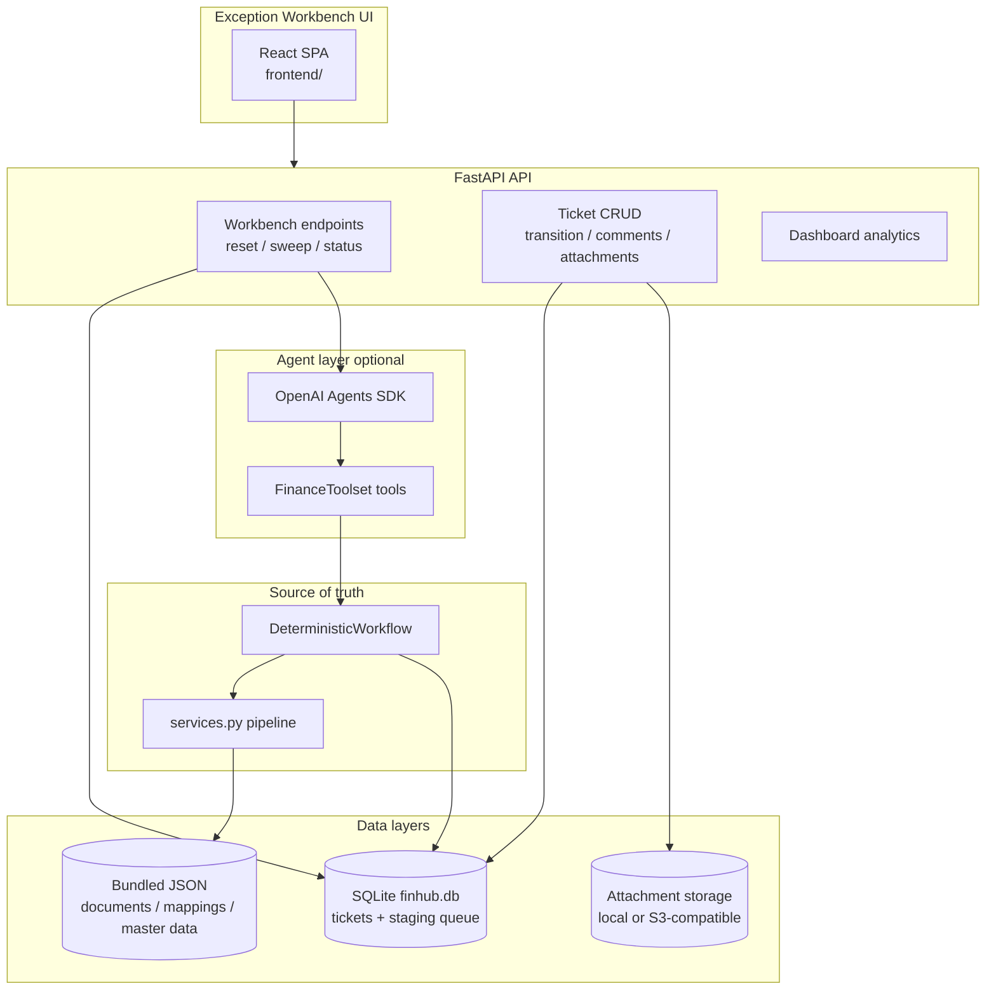

# FinHub Architecture

> Technical architecture for FinHub - Agentic Document Resolution Workbench.
> For setup commands see [`README.md`](../README.md). For Railway see [`DEPLOYMENT.md`](../DEPLOYMENT.md).

## System overview

FinHub simulates Central Finance failed-document replication remediation using **synthetic data** and **deterministic policy services**. OpenAI Agents SDK orchestration is optional; all operational agents use `gpt-4o-mini` by default, the analyst summary writer uses `gpt-4o`, and agents cannot bypass guardrails.



## Execution paths

| Path | Entry | When used |
|------|--------|-----------|
| **CLI** | `uv run cfin-demo DOC-1002` | Quick smoke checks, scripting |
| **Workbench UI** | `bash scripts/dev-workbench.sh` | Operator demos, triage |
| **Eval providers** | Promptfoo / pytest | Regression testing |

All paths converge on `DeterministicWorkflow` for authoritative outcomes. When `OPENAI_API_KEY` is set and `DISABLE_LLM=0`, `AgenticWorkflow` runs agents first, then locks the deterministic result.

## Workbench demo loop (UI-driven)

No terminal seed/sweep is required for demos. The **Workbench Controls** panel drives the full loop:

1. **Reset & seed queue** — `POST /api/workbench/reset` clears tickets, staging, attachments; seeds N synthetic failed documents (`NEW` in staging).
2. **Run agent processing** — `POST /api/workbench/sweep` claims staging rows, runs `AgenticWorkflow`, creates tickets with LLM summaries.
3. **Triage** — operator updates `operator_status`, adds comments, uploads proof on resolve.
4. **Refresh** — reloads tickets and queue counts.

CLI equivalents (still supported): `uv run cfin-seed`, `uv run cfin-sweep`.

## Service pipeline

```
SyntheticRepository → Validator → DiagnosisService → RemediationPlanner → PolicyEngine → ReprocessingService
```

Orchestrated by `DeterministicWorkflow` in `services.py` / `workflow.py`. Records `AuditLog` events on every step.

**PolicyEngine** (no document value thresholds):

| Remediation action | Without approval | With approval |
|--------------------|------------------|---------------|
| `MAINTAIN_SOURCE_MAPPING` | Allowed → reprocess | — |
| `CREATE_TARGET_MASTER_DATA` | `needs_approval` | Allowed → reprocess |
| `EXTERNAL_CONTROLLER_ACTION_REQUIRED` (closed period) | Always `blocked` | — |

After the workflow completes, `generate_analyst_summary()` writes `agent_summary`:

- **`SUMMARY_USE_LLM=1` + `OPENAI_API_KEY`:** LLM text via `SUMMARY_MODEL=gpt-4o` (exported to Langfuse as `analyst-summary` generation).
- **Otherwise:** eval-aligned deterministic template from `analyst_summary.py`.

`resolve_agent_summary()` polishes stored text on read and returns `None` for missing or legacy verbose summaries — it does **not** regenerate summaries on read.

## Ticket and status model

Tickets separate **operator workflow** from **agent policy context** and **internal journey timeline**.

| Field | Purpose |
|-------|---------|
| `operator_status` | Human-editable queue status: `assigned`, `in_progress`, `blocked`, `resolved` |
| `workflow_run.status` | Agent policy / pipeline stage (exposed as `workflow_status` in list API) — see staged pipeline below |
| `policy_summary` | Plain-English policy guidance from agent run |
| `agent_summary` | Analyst diagnosis text (persisted at ticket creation; polished on read via `resolve_agent_summary()`) |
| `timeline[]` | Activity log — ingestion, diagnosis, assignment, manual transitions |

Legacy SQLite payloads with `status`, `policy_status`, `is_pending_approval`, `is_blocked` are migrated on read via `ticket_migration.py`.

**Staged reprocessing pipeline (workbench-only, not part of the deterministic engine):**

`DeterministicWorkflow.run()` always resolves a scenario in one deterministic pass — there is no
notion of "in progress" in the engine itself. The workbench simulates the real-world lag between a
human action and the document actually landing in the target system by capping and then advancing
`workflow_run.status` at the ticket/API layer:

```
CREATE_TARGET_MASTER_DATA:  needs_approval → [Approve] → approved → (lag) → ready_for_reprocessing → (lag) → reprocessed
MAINTAIN_SOURCE_MAPPING:    needs_mapping  → [Maintain Mapping] → mapping_maintained → (lag) → ready_for_reprocessing → (lag) → reprocessed
```

- `needs_mapping` is itself a workbench-only cap: `MAINTAIN_SOURCE_MAPPING` has no approval-store
  gate in `PolicyEngine`, so a single `workflow.run()` call (CLI, evals) already resolves straight to
  `reprocessed`. `ticketing.cap_pending_mapping_run()` rolls a freshly-created ticket's *stored*
  `workflow_run` back to `needs_mapping` with `reprocess_result=None` — this only affects ticket
  presentation, never the deterministic engine, evals, or CLI single-shot runs.
- Both `/approve` and `/maintain-mapping` compute the final outcome immediately (cheap and
  deterministic) but only expose the first stage; `api._schedule_reprocessing_pipeline()` uses two
  `threading.Timer` callbacks (`WORKFLOW_STAGE_LAG_SECONDS` env, default 6s each) to advance the
  ticket through `ready_for_reprocessing` and then to the full `reprocessed` result. In-memory only —
  a mid-pipeline restart leaves a ticket stuck at its last-reached stage (same limitation as the
  sweep-job registry).
- Neither action ever sets `operator_status`. The ticket owner manually resolves via
  `POST /api/tickets/{id}/transition`, which is rejected until `workflow_run.status == reprocessed`
  for these two actions.

**Governance rules in the UI:**

- **Blocked** — requires a comment (stored on ticket + activity log).
- **Resolved** — requires at least one proof attachment (image, PDF, CSV, etc.) **and** a non-empty
  reason/note. For `CREATE_TARGET_MASTER_DATA` / `MAINTAIN_SOURCE_MAPPING` tickets, also requires
  `workflow_run.status == reprocessed`.

## Persistence

| Layer | Location | Contents |
|-------|----------|----------|
| **Bundled read-only** | `data/synthetic/*.json` | Source documents, mappings, target master data (in Docker image) |
| **Runtime SQLite** | `{FINHUB_DATA_DIR}/finhub.db` | Staging queue + ticket JSON payloads |
| **Attachments** | `{FINHUB_DATA_DIR}/attachments/` or S3 | Binary proof files; metadata in ticket payload |

Environment:

| Variable | Default | Purpose |
|----------|---------|---------|
| `FINHUB_DATA_DIR` | `data/synthetic` | Root for SQLite + local attachment files |
| `STORAGE_BACKEND` | `local` | `local` or `s3` for attachment blobs |
| `S3_*` | — | S3-compatible credentials when `STORAGE_BACKEND=s3` |

On Railway, mount a **volume** and set `FINHUB_DATA_DIR` for durable demos. S3 is optional for production-shaped attachment storage.

Implementation: `document_store.py`, `attachment_store.py`, `paths.py`, `seed_queue.py`.

## API surface

### Workbench (primary)

| Method | Path | Purpose |
|--------|------|---------|
| GET | `/api/health` | Health, `storage_backend`, `data_dir`, `langfuse` status |
| GET | `/api/workbench/status` | Ticket/staging counts, `summary_source`, Langfuse status |
| POST | `/api/workbench/reset?count=&seed=` | Clear + reseed staging queue (count 1–500) |
| POST | `/api/workbench/clear` | Clear tickets/staging without reseed |
| POST | `/api/workbench/sweep` | Start background sweep job → `{job_id}` (`"wait": true` runs synchronously) |
| GET | `/api/workbench/sweep/jobs/{job_id}` | Poll sweep job progress/result |
| GET | `/api/workbench/assignees` | Role → assignee options for reassignment |
| GET | `/api/tickets` | Filterable list (`status` → `operator_status`, `owner_role`, `priority`, `reason_code`) |
| GET | `/api/tickets/{id}` | Detail + narratives + `langfuse_trace_url` |
| PATCH | `/api/tickets/{id}/description` | Edit ticket title/description |
| PATCH | `/api/tickets/{id}/assignee` | Reassign owner (timeline `reassigned` event) |
| POST | `/api/tickets/{id}/transition` | Update `operator_status` (blocked requires note; resolved requires proof + reason, and `reprocessed` if the ticket is on a staged path) |
| POST | `/api/tickets/{id}/approve` | `needs_approval` only → `approved`, then auto-advances to `ready_for_reprocessing` → `reprocessed` on a delay (see staged pipeline above) |
| POST | `/api/tickets/{id}/maintain-mapping` | `needs_mapping` only → `mapping_maintained`, then auto-advances the same way |
| POST | `/api/tickets/{id}/summary-feedback` | 👍/👎 on `agent_summary` → `summary_feedback.jsonl` |
| POST | `/api/tickets/{id}/comments` | Add comment |
| POST | `/api/tickets/{id}/attachments` | Upload proof file |
| GET | `/api/tickets/{id}/attachments/{attachment_id}` | Download/view attachment |
| GET | `/api/dashboard/summary` | Analytics + business-value aggregates (USD-eq demo FX, SLA breaches, aging, automation rate) |
| GET | `/api/dashboard/stage-matrix?limit=` | Per-ticket stage durations (API only; UI uses dashboard summary) |

### Legacy demo endpoints

Still present for scripting; the React workbench uses `/api/workbench/*` instead.

| Method | Path | Purpose |
|--------|------|---------|
| POST | `/api/demo/bootstrap` | Reset + **deterministic** batch diagnose → tickets |
| POST | `/api/demo/fresh-run` | Same as bootstrap (duplicate alias) |
| POST | `/api/demo/golden-document?document_id=&approve=` | Reset store + single doc through **agentic** workflow |
| POST | `/api/jobs/diagnose-new` | **Deterministic** diagnose of `NEW` staging rows only |

## CLI commands

| Command | Agentic? | Purpose |
|---------|----------|---------|
| `uv run cfin-demo DOC-1002 [--approve] [--deterministic]` | Yes (default) | Single-document workflow |
| `uv run cfin-seed [--count] [--reset \| --clear-only]` | — | Seed/clear staging queue |
| `uv run cfin-sweep [--batch-size]` | Yes | Staging → agentic workflow → tickets |
| `uv run cfin-api` | — | FastAPI server |
| `uv run cfin-batch-demo` | **No** | Legacy deterministic bootstrap |
| `uv run cfin-refresh-summaries` | Summary path | Refresh/clear ticket summaries |

## Frontend structure

| Area | Description |
|------|-------------|
| **Workbench Controls** | Seed count, reset, sweep batch size, refresh, sweep progress bar (job polling) |
| **Business Impact panel** | Value at risk / total value failed (USD-eq), by company code / source system (click-to-filter), SLA breaches, aging buckets, automation rate |
| **Analytics panel** | KPIs, status breakdown, owner chart, stage times |
| **Ticket detail** | Agent diagnosis hero (execution badge, summary feedback, shadow note), approve & maintain-mapping actions with a live staged-pipeline stepper (polls while in-flight), assignee select, metadata, status, comments, attachments, activity log |
| **Search Tickets** | Filters + business-filter chips, sortable table, inline status dropdown, bulk status moves |

Dev: Vite on `:5173` proxies `/api` → `:8000` (same-origin; no `VITE_API_BASE` needed).  
Production: `frontend/dist` served by FastAPI on one port; API client defaults to same-origin `/api`.

Optional: `VITE_API_BASE` overrides the API host (split deployment only).

Key files: `frontend/src/App.tsx` (orchestrator), `frontend/src/components/*` (panels, table, detail, dialogs), `frontend/src/lib/format.ts` (shared helpers), `frontend/src/api/client.ts`.

## Observability (Langfuse)

Module: `src/cfin_agents/observability.py`. Graceful no-op when credentials are absent.

| Function | Role |
|----------|------|
| `configure_openai_agents_tracing()` | OpenInference instrumentor → OTLP HTTP → Langfuse; initialized in `AgenticWorkflow` |
| `workflow_observation()` | Root span per run (`agentic-cfin-workflow`); sets `session_id`, tags; yields `trace_id` → `WorkflowRun.langfuse_trace_id` |
| `summary_generation_observation()` | Langfuse `generation` span (`analyst-summary`) for `SUMMARY_MODEL` LLM call |
| `langfuse_status()` | Connectivity check for health/workbench endpoints |
| `langfuse_trace_url()` | `{host}/trace/{id}` linked from ticket detail UI |

Trace hierarchy when Langfuse is enabled:

```text
agentic-cfin-workflow (root span)
├── OpenAI Agents SDK spans (OPENAI_MODEL=gpt-4o-mini)
└── analyst-summary (generation, SUMMARY_MODEL=gpt-4o)
```

## Agent tools

`FinanceToolset` in `toolkit.py` wraps deterministic services:

- `document_context()` — validation issues + mappings
- `classify_failure()` — diagnosis + reason code
- `propose_remediation()` — remediation plan
- `evaluate_governance()` — policy decision
- `controlled_reprocess()` — reprocess only if allowed

## Evals (regression)

| Layer | Source | Count |
|-------|--------|-------|
| Deterministic | `evals/deterministic_cases.yaml` | 12 cases |
| Summary judge | `evals/summary_cases.yaml` | 10 golden docs |

Evals run locally or in GitHub Actions — **not** on the Railway service. See [`CI.md`](../CI.md), [`promptfoo.md`](../promptfoo.md), [`Evals-Journey.md`](../Evals-Journey.md).

## Key modules

| Module | Role |
|--------|------|
| `workflow.py` | Agentic vs deterministic execution |
| `services.py` | Policy, diagnosis, reprocess, analyst summary |
| `ticketing.py` | Ticket creation, routing, dashboard aggregates |
| `sweep.py` | Staging batch → agentic workflow → tickets |
| `seed_queue.py` | Reset workbench, seed synthetic queue |
| `analyst_summary.py` | Summary generation, polish, read-time resolution |
| `observability.py` | Langfuse tracing (workflow + summary generations) |
| `api.py` | REST API + static frontend in production |

## Deployment topology (Railway)

Multi-stage **`Dockerfile`** (configured via `railway.json` → `"builder": "DOCKERFILE"`):

1. **frontend-builder** — `node:22-bookworm-slim` → `npm ci` + `vite build`
2. **runtime** — `ghcr.io/astral-sh/uv:python3.11-bookworm-slim` → `uv sync --frozen --no-dev` + copy `frontend/dist`
3. `CMD uv run cfin-api` — binds `0.0.0.0:$PORT` when Railway sets `PORT`

**Persistence:** create a Railway Volume (project canvas → **`⌘K`** → Create Volume) mounted at `/data`, then set `FINHUB_DATA_DIR=/data/finhub` and `RAILWAY_RUN_UID=0`.

**Health check:** `GET /api/health` (120s timeout in `railway.json`).

**Langfuse trace example:** [`docs/LANGFUSE-TRACE-EXAMPLE.md`](LANGFUSE-TRACE-EXAMPLE.md) — annotated walkthrough of trace `b268da541f455e73279bf2bda22fb7c6`.

Frontend pins **Vite 6** for reliable Linux Docker builds. Local dev uses Vite 6 on `:5173` with API proxy; production serves `frontend/dist` from FastAPI on one port.

See [`DEPLOYMENT.md`](../DEPLOYMENT.md) for step-by-step setup and troubleshooting.

## Legacy / archived surfaces

| Surface | Status |
|---------|--------|
| Streamlit app (`app/streamlit_app.py`, `archive/app/`) | **Archived** — replaced by React workbench; not part of deployment |
| `/api/demo/*`, `/api/jobs/diagnose-new` | Legacy scripting endpoints; workbench uses `/api/workbench/*` |
| `cfin-batch-demo` | Deterministic bootstrap CLI; not agentic |
