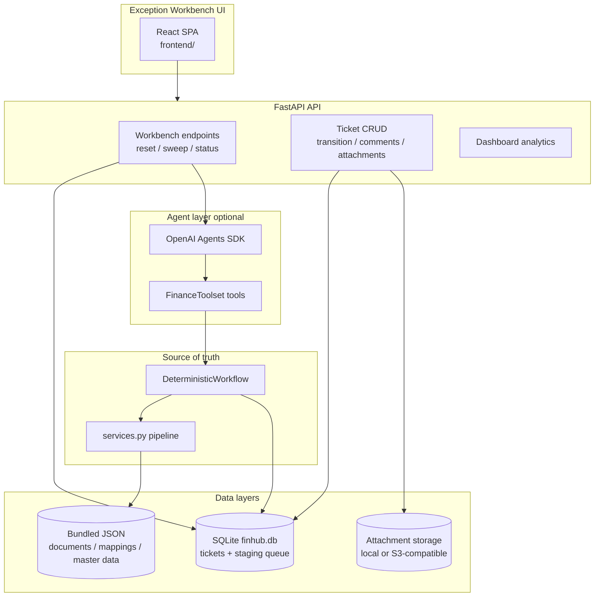

# FinHub Architecture

> Technical architecture for the Agentic CFIN workflow prototype and exception workbench.  
> For setup commands see [`README.md`](../README.md). For Railway see [`DEPLOYMENT.md`](../DEPLOYMENT.md).

## System overview

FinHub simulates Central Finance failed-document replication remediation using **synthetic data** and **deterministic policy services**. OpenAI Agents SDK orchestration is optional; agents call tools but cannot bypass guardrails.



## Execution paths

| Path | Entry | When used |
|------|--------|-----------|
| **CLI** | `uv run cfin-demo DOC-1002` | Quick smoke checks, scripting |
| **Workbench UI** | `bash scripts/dev-workbench.sh` | Operator demos, triage |
| **Eval providers** | Promptfoo / pytest | Regression testing |

All paths converge on `DeterministicWorkflow` for authoritative outcomes. When `OPENAI_API_KEY` is set and `DISABLE_LLM=0`, `AgenticWorkflow` runs agents first, then locks the deterministic result.

## Workbench demo loop (UI-driven)

No terminal seed/sweep is required for demos. The **Workbench Controls** panel drives the full loop:

1. **Reset & seed queue** — `POST /api/workbench/reset` clears tickets, staging, attachments; seeds N synthetic failed documents (`NEW` in staging).
2. **Run agent processing** — `POST /api/workbench/sweep` claims staging rows, runs `AgenticWorkflow`, creates tickets with LLM summaries.
3. **Triage** — operator updates `operator_status`, adds comments, uploads proof on resolve.
4. **Refresh** — reloads tickets and queue counts.

CLI equivalents (still supported): `uv run cfin-seed`, `uv run cfin-sweep`.

## Service pipeline

```
SyntheticRepository → Validator → DiagnosisService → RemediationPlanner → PolicyEngine → ReprocessingService
```

Orchestrated by `DeterministicWorkflow` in `services.py` / `workflow.py`. Records `AuditLog` events on every step.

**PolicyEngine** (no document value thresholds):

| Remediation action | Without approval | With approval |
|--------------------|------------------|---------------|
| `MAINTAIN_SOURCE_MAPPING` | Allowed → reprocess | — |
| `CREATE_TARGET_MASTER_DATA` | `needs_approval` | Allowed → reprocess |
| `EXTERNAL_CONTROLLER_ACTION_REQUIRED` (closed period) | Always `blocked` | — |

After the workflow completes, `generate_analyst_summary()` writes `agent_summary` when `SUMMARY_USE_LLM=1` and `OPENAI_API_KEY` is set; otherwise eval-aligned deterministic text is stored at creation time.

## Ticket and status model

Tickets separate **operator workflow** from **agent policy context** and **internal journey timeline**.

| Field | Purpose |
|-------|---------|
| `operator_status` | Human-editable queue status: `assigned`, `in_progress`, `blocked`, `resolved` |
| `workflow_run.status` | Agent policy outcome: `needs_approval`, `blocked`, `reprocessed`, etc. (exposed as `workflow_status` in list API) |
| `policy_summary` | Plain-English policy guidance from agent run |
| `agent_summary` | LLM analyst diagnosis (persisted at ticket creation; polished on read) |
| `timeline[]` | Activity log — ingestion, diagnosis, assignment, manual transitions |

Legacy SQLite payloads with `status`, `policy_status`, `is_pending_approval`, `is_blocked` are migrated on read via `ticket_migration.py`.

**Governance rules in the UI:**

- **Blocked** — requires a comment (stored on ticket + activity log).
- **Resolved** — requires at least one proof attachment (image, PDF, CSV, etc.).

## Persistence

| Layer | Location | Contents |
|-------|----------|----------|
| **Bundled read-only** | `data/synthetic/*.json` | Source documents, mappings, target master data (in Docker image) |
| **Runtime SQLite** | `{FINHUB_DATA_DIR}/finhub.db` | Staging queue + ticket JSON payloads |
| **Attachments** | `{FINHUB_DATA_DIR}/attachments/` or S3 | Binary proof files; metadata in ticket payload |

Environment:

| Variable | Default | Purpose |
|----------|---------|---------|
| `FINHUB_DATA_DIR` | `data/synthetic` | Root for SQLite + local attachment files |
| `STORAGE_BACKEND` | `local` | `local` or `s3` for attachment blobs |
| `S3_*` | — | S3-compatible credentials when `STORAGE_BACKEND=s3` |

On Railway, mount a **volume** and set `FINHUB_DATA_DIR` for durable demos. S3 is optional for production-shaped attachment storage.

Implementation: `document_store.py`, `attachment_store.py`, `paths.py`, `seed_queue.py`.

## API surface (workbench)

| Method | Path | Purpose |
|--------|------|---------|
| GET | `/api/health` | Health + storage backend info |
| GET | `/api/workbench/status` | Ticket count, staging counts, summary source |
| POST | `/api/workbench/reset?count=&seed=` | Clear + reseed staging queue |
| POST | `/api/workbench/clear` | Clear tickets/staging without reseed |
| POST | `/api/workbench/sweep` | Process batch from staging → tickets |
| GET | `/api/tickets` | Filterable ticket list |
| GET | `/api/tickets/{id}` | Ticket detail (enriched narratives) |
| POST | `/api/tickets/{id}/transition` | Update `operator_status` |
| POST | `/api/tickets/{id}/comments` | Add comment |
| POST | `/api/tickets/{id}/attachments` | Upload proof file |
| GET | `/api/dashboard/summary` | Analytics aggregates |

## Frontend structure

| Area | Description |
|------|-------------|
| **Workbench Controls** | Seed count, reset, sweep batch size, refresh |
| **Analytics panel** | KPIs, status breakdown, owner chart, stage times |
| **Ticket detail** | Agent diagnosis hero, metadata, status, comments, attachments, activity log |
| **Search Tickets** | Filters, sortable table, inline status dropdown |

Dev: Vite on `:5173` proxies `/api` → `:8000`.  
Production: `frontend/dist` served by FastAPI after `npm --prefix frontend run build`.

Key files: `frontend/src/App.tsx`, `frontend/src/api/client.ts`.

## Agent tools

`FinanceToolset` in `toolkit.py` wraps deterministic services:

- `document_context()` — validation issues + mappings
- `classify_failure()` — diagnosis + reason code
- `propose_remediation()` — remediation plan
- `evaluate_governance()` — policy decision
- `controlled_reprocess()` — reprocess only if allowed

## Evals (regression)

| Layer | Source | Count |
|-------|--------|-------|
| Deterministic | `evals/deterministic_cases.yaml` | 12 cases |
| Summary judge | `evals/summary_cases.yaml` | 10 golden docs |

Evals run locally or in GitHub Actions — **not** on the Railway service. See [`CI.md`](../CI.md), [`promptfoo.md`](../promptfoo.md), [`Evals-Journey.md`](../Evals-Journey.md).

## Key modules

| Module | Role |
|--------|------|
| `workflow.py` | Agentic vs deterministic execution |
| `services.py` | Policy, diagnosis, reprocess, analyst summary |
| `ticketing.py` | Ticket creation, routing, dashboard aggregates |
| `sweep.py` | Staging batch → agentic workflow → tickets |
| `seed_queue.py` | Reset workbench, seed synthetic queue |
| `analyst_summary.py` | Summary generation, polish, read-time resolution |
| `api.py` | REST API + static frontend in production |

## Deployment topology (Railway)

Single Nixpacks service:

1. `uv sync` + `npm --prefix frontend ci`
2. `npm --prefix frontend run build`
3. `uv run cfin-api` on `$PORT` (binds `0.0.0.0`)

Optional Railway Volume → `FINHUB_DATA_DIR=/data/finhub`.

See [`DEPLOYMENT.md`](../DEPLOYMENT.md) for step-by-step setup.
