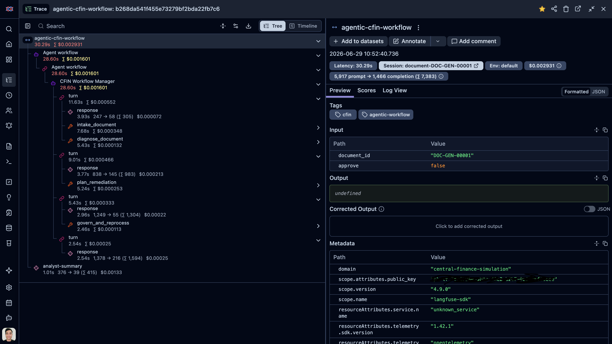
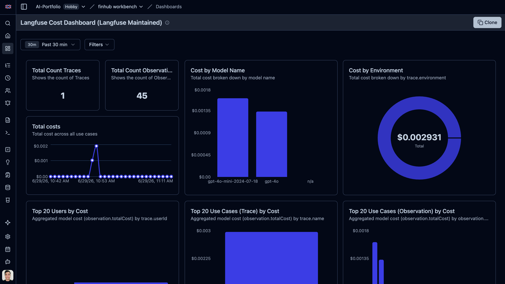

# Langfuse trace example - FinHub workflow run

This walks through a real trace from **FinHub - Agentic Document Resolution Workbench** exported from Langfuse:

- **Trace ID:** `b268da541f455e73279bf2bda22fb7c6`
- **Raw export:** [`trace-b268da541f455e73279bf2bda22fb7c6.json`](trace-b268da541f455e73279bf2bda22fb7c6.json)
- **Document:** `DOC-GEN-00001` (synthetic failed finance document from the workbench queue)
- **Duration:** ~30 seconds
- **Outcome:** `needs_approval` — document was **not** reprocessed (human approval required first)



## The story in one paragraph

A failed customer document landed in the queue. The **Workflow Manager** agent (`gpt-4o-mini`) coordinated specialist steps: load the document, diagnose the failure, plan a fix, and check policy. The **deterministic tools** (not the LLM) decided the root cause was **missing customer master data** and that creating master data **requires human approval** before reprocessing. The agents did **not** reprocess the document. After that, a separate **`analyst-summary`** call (`gpt-4o`) wrote the short plain-English text shown on the ticket.

## Trace tree (simplified)

```text
agentic-cfin-workflow                    ← root span (~30s)
├── Agent workflow (OpenAI Agents SDK)
│   └── CFIN Workflow Manager            ← gpt-4o-mini orchestrates
│       ├── intake_document              ← load document + validation context
│       ├── diagnose_document
│       │   └── classify_failure       ← deterministic: MD_CUSTOMER_MASTER_DATA_MISSING
│       ├── plan_remediation
│       │   └── propose_remediation    ← deterministic: create_target_master_data
│       └── govern_and_reprocess
│           └── evaluate_governance    ← deterministic: needs_approval, allowed=false
└── analyst-summary                      ← gpt-4o (~1s) — ticket text for the analyst
```

## Step by step

| Step | What happened | Who decided |
|------|----------------|-------------|
| 1. Intake | Loaded source document (ERP-NA, company 3000) and validation errors for business partner `BP-SRC-NEWCUST` | Tool: `document_context` |
| 2. Diagnose | Classified as **missing customer master data** in the target system | Tool: `classify_failure` → `MD_CUSTOMER_MASTER_DATA_MISSING` |
| 3. Plan | Proposed **create customer master data**, then maintain mapping, then reprocess | Tool: `propose_remediation` → `create_target_master_data` |
| 4. Govern | Policy blocked reprocessing because **approval was not recorded** | Tool: `evaluate_governance` → `needs_approval`, `allowed: false` |
| 5. Summary | Wrote 2–3 sentences for the finance analyst on the ticket | LLM: `gpt-4o` (`analyst-summary` generation) |

## What the analyst sees (from `analyst-summary`)

> Document posting failed due to missing customer master data in the target system. Approval is required before creating the target master data. Once approved, maintain the source-to-target mapping and reprocess the document.

This matches the policy outcome: explain the problem, say approval is needed, describe next steps — **without** reprocessing yet.

## Two models, two jobs

| Span / generation | Model | Role |
|-------------------|-------|------|
| Agent SDK `response` generations | `gpt-4o-mini` | Orchestration — which tool to call next, natural-language reasoning |
| `analyst-summary` | `gpt-4o` | Final ticket-facing summary only (~1s, small token count) |



The agents **coordinate** the work; the **deterministic Python services** inside the tools are the **source of truth** for status, reason codes, and whether reprocessing is allowed.

## Why this trace matters for the demo

It shows the design working as intended:

1. **Agentic layer** — visible, auditable steps in Langfuse (intake → diagnose → plan → govern).
2. **Guardrails** — policy blocked auto-reprocess even though the agent knew the remediation steps.
3. **Separation of concerns** — orchestration model vs summary model; tools vs LLM judgment on policy.
4. **Operator handoff** — ticket lands in the workbench as **needs approval** with a clear analyst summary.

## How to find this in Langfuse

In the workbench, open a ticket processed after Langfuse was configured and click **View trace in Langfuse**. Look for:

- Trace name: `agentic-cfin-workflow`
- Session: `document-{document_id}`
- Tags: `cfin`, `agentic-workflow`

Or open the trace directly if you have the ID: `{LANGFUSE_HOST}/trace/b268da541f455e73279bf2bda22fb7c6`
