# Promptfoo and Human-Graded Evals

This note explains how the human eval work we did connects to Promptfoo.

The goal is simple:

> Turn our manual summary scoring process into an automated test loop.

---

## 1. Where We Started

Our system produces an `agent_summary` for a failed Central Finance document.

Example:

```text
DOC-1001 failed because GL account master data is missing in the target system.
Approval is required before creating the master data, maintaining the mapping,
and reprocessing the document.
```

This output is written in natural language.

That creates a problem:

> There is no single exact sentence that is always correct.

Two summaries can use different words and both be good.

So we cannot evaluate summaries with exact string matching.

---

## 2. What We Built Manually

We created a human grading process first.

That process has three main pieces.

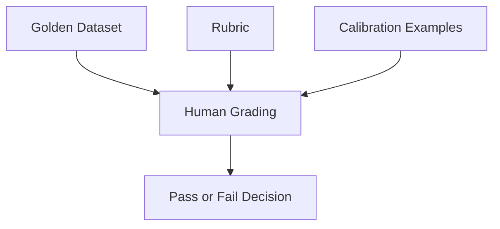

### Golden Dataset

The golden dataset says what the correct answer should contain.

For each document, it defines the truth.

Example for `DOC-1001`:

```text
Root cause:
GL account master data is missing in the target system.

Expected status:
needs_approval

Expected action:
create_target_master_data

Required follow-on:
maintain_source_mapping

Must mention:
- approval is required
- create missing GL master data
- maintain source-to-target mapping
- reprocess only after those steps

Must not say:
- missing mapping is the root cause
- reprocess without approval
```

This is the source of truth for automation.

**Coverage today:** `evals/summary_cases.yaml` has **10** golden cases (all synthetic failure scenarios). Three were human-labeled in `AI Evals_SM5_v0.6.xlsx` (DOC-1001, DOC-1002, DOC-1006). The other seven follow the same three policy patterns (missing master data, missing mapping, closed period) and were validated by the LLM judge. Excel is optional to extend for full human parity.

### Rubric

The rubric tells us how to score the summary.

We used four dimensions:

| Dimension | What It Checks | Gate? |
|---|---|---|
| Accuracy | Did the summary preserve the true root cause, status, and policy decision? | Yes |
| Actionability | Did it tell the analyst the correct next safe action? | Yes |
| Audience fit | Is it understandable for a finance analyst? | No |
| Conciseness | Is it short enough for triage? | No |

The key rule:

```text
To pass:
accuracy >= 4
AND
actionability >= 4
```

This means a summary cannot pass just because its average score is high.

If it gets the root cause wrong, it fails.

If it gives the wrong next action, it fails.

### Calibration Examples

Calibration examples show what a pass and fail look like.

Example bad summary for `DOC-1001`:

```text
Document posting failed due to missing GL Account. Please re-process the document.
```

Why this fails:

- It is too vague.
- It does not mention approval.
- It does not mention creating target master data.
- It does not mention maintaining mapping.
- It suggests reprocessing too early.

Example good summary for `DOC-1001`:

```text
Document posting failed because GL account master data is missing in the target
system. The document has not been reprocessed yet and requires approval before
target master data can be created. After approval is recorded, create the
required GL account master data, maintain the source-to-target mapping, and then
reprocess the document.
```

Why this passes:

- It identifies the correct root cause.
- It says approval is required.
- It gives the correct sequence.
- It does not say mapping is the root cause.

---

## 3. What We Did by Hand

For the first version, we manually scored live model outputs.

The process looked like this:

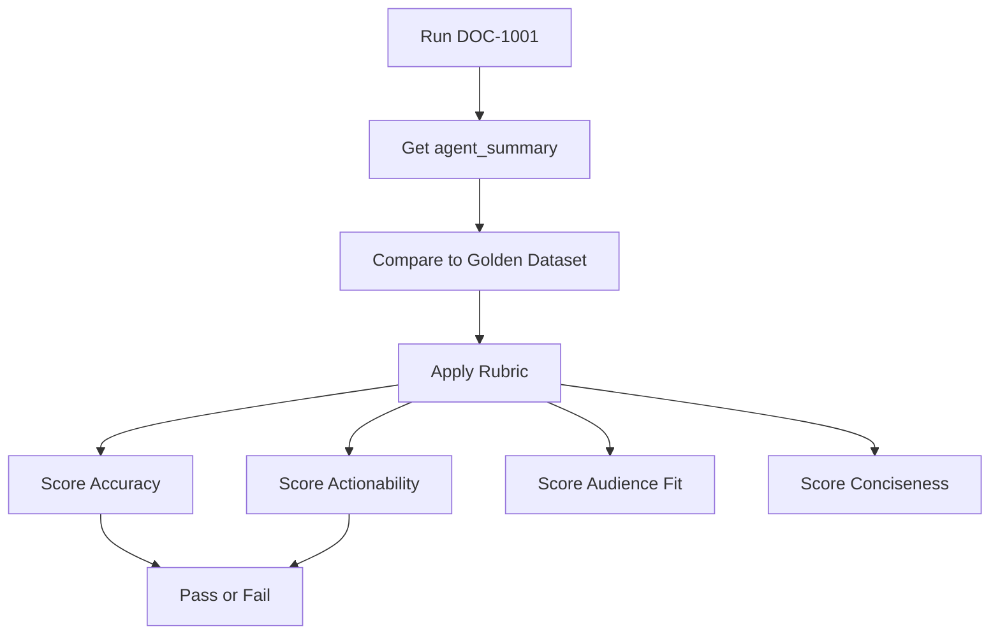

Example:

```text
Generated summary:
DOC-1001 failed because GL master data is missing.
Approval is required before creating master data, maintaining mapping,
and reprocessing.
```

Manual score:

```text
Accuracy: 5
Actionability: 5
Overall: Pass
```

This manual process is useful, but it does not scale.

If we later have 10, 50, or 100 cases, we do not want to manually score every run.

That is where Promptfoo comes in.

---

## 4. What Promptfoo Is

Promptfoo is a test runner for AI systems.

The simplest way to think about it:

> Promptfoo is like pytest, but for prompts and LLM outputs.

For normal code, a test might look like this:

```python
assert add(2, 3) == 5
```

That works because the output is exact.

For LLM summaries, exact matching is too brittle.

Promptfoo helps run the same kind of repeatable tests, but it can evaluate:

- exact fields, like `status == needs_approval`
- JSON output
- text output
- model-graded output using an LLM judge

---

## 5. Promptfoo's Role in Our Project

Promptfoo will automate the loop we performed manually.

Manual loop:

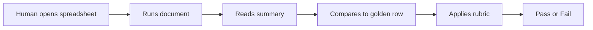

Automated Promptfoo loop:

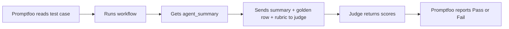

Promptfoo is not the judge by itself.

Promptfoo is the orchestrator.

It runs the test and collects the result.

The LLM judge is one possible check inside Promptfoo.

---

## 6. Is Promptfoo Enabling LLM-as-Judge?

Yes.

But the roles are different.

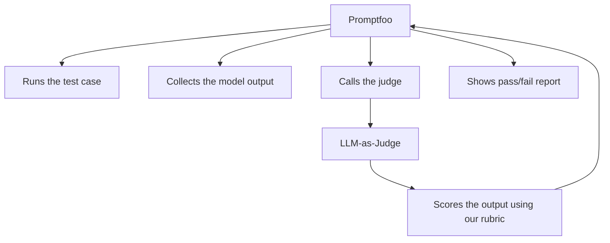

Promptfoo asks the judge:

```text
Here is the generated summary.
Here is the golden truth.
Here is the rubric.

Score accuracy from 1-5.
Score actionability from 1-5.
Pass only if both are >= 4.
Explain your reasoning.
```

The LLM judge then returns something like:

```json
{
  "accuracy_score": 5,
  "actionability_score": 4,
  "overall_pass": true,
  "reasoning": "The summary identifies the correct root cause and gives the safe next action."
}
```

Promptfoo records that result.

---

## 7. Important Mental Model

The golden dataset is the truth.

The LLM judge is not the truth.

Promptfoo is not the truth.

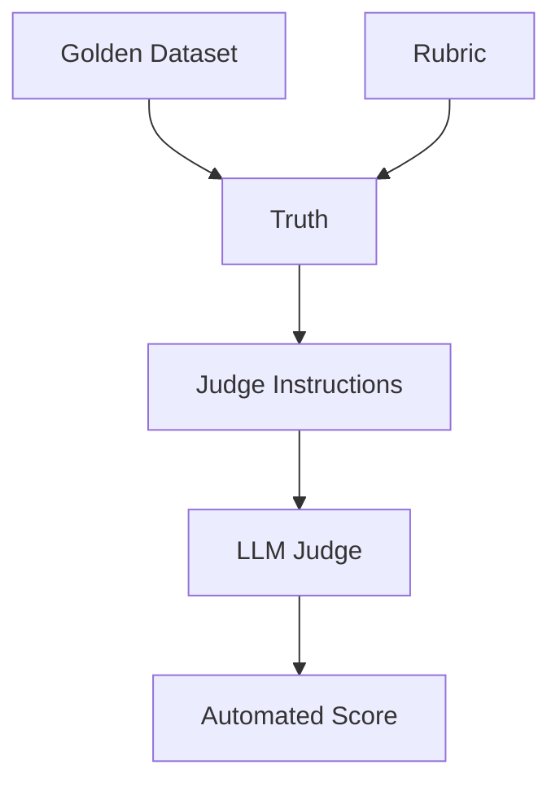

The judge is only useful if it applies our rubric correctly.

That is why calibration matters.

---

## 8. Why Calibration Matters

Before we trust an LLM judge, we test it against examples we already scored by hand.

Example:

```text
Human says:
DOC-1001 bad example = Fail

Judge should also say:
Fail
```

And:

```text
Human says:
DOC-1001 good example = Pass

Judge should also say:
Pass
```

If the judge disagrees with our calibration examples, we do not trust it yet.

Instead, we improve the judge prompt.

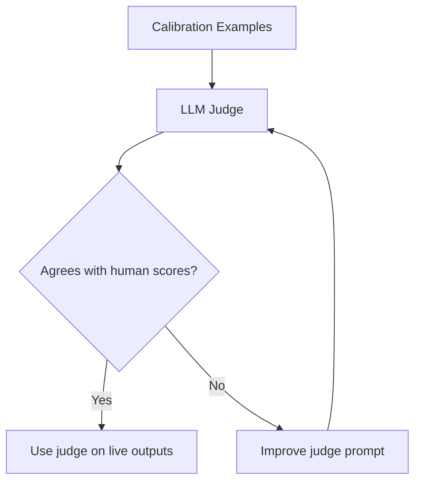

Calibration makes the automated judge safer.

---

## 9. Our Current Evals Pipeline

Right now, we have two kinds of evals.

### Deterministic Evals

These check structured workflow behavior.

Example:

```text
DOC-1001 expected status: needs_approval
DOC-1001 actual status: needs_approval
Pass
```

These are exact checks.

They do not need an LLM judge.

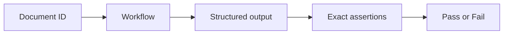

### Summary Evals

These check the quality of the natural-language `agent_summary`.

Example:

```text
Did the summary correctly explain why DOC-1001 failed?
Did it tell the analyst approval is required?
Did it avoid saying mapping is the root cause?
```

These need judgment.

That is where LLM-as-judge helps.

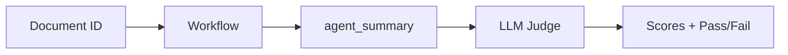

---

## 10. Full Future Flow

The complete automated flow will look like this:

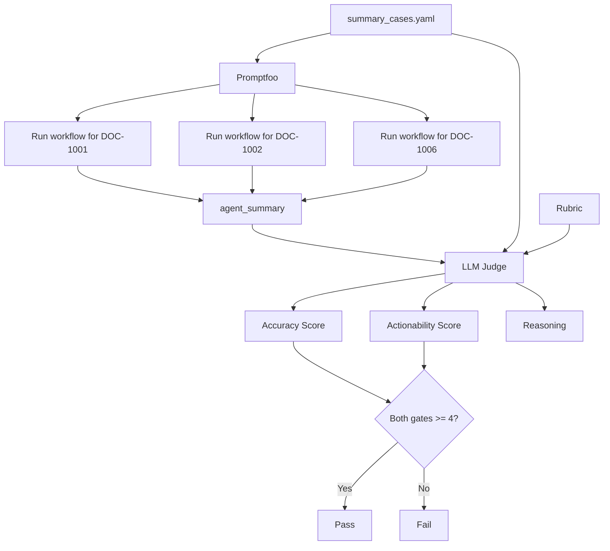

This means every time we change the prompt or code, we can re-run the eval.

If the summary quality gets worse, the eval catches it.

---

## 11. Concrete Example: DOC-1002

### Golden Truth

```text
Root cause:
Missing cost center source-to-target mapping.

Expected action:
Maintain source-to-target mapping.

Approval:
Not required.

Must not say:
Reprocessing requires approval.
```

### Bad Generated Summary

```text
The proposed action was approved and executed.
```

Why this is bad:

- It makes the user think approval happened.
- But this case only needs manual mapping maintenance; approval is not required.

Human score:

```text
Accuracy: 4
Actionability: 3
Pass: false
```

### Fixed Generated Summary

```text
Document posting failed because the cost center source-to-target mapping is
missing. Maintain the missing mapping entry manually in the target mapping
table, then reprocess the document. No approval is required.
```

Why this is better:

- It avoids false approval language.
- It separates the missing mapping root cause from the follow-on reprocess action.
- It tells the analyst exactly what to do next.

Human score:

```text
Accuracy: 5
Actionability: 4
Pass: true
```

Promptfoo's job is to help us run this kind of check automatically.

---

## 12. How to Run Promptfoo

Promptfoo runs through **Node.js** (`npx`). The test providers are **Python** files in
`evals/`. You need both installed (already set up in this project).

### Prerequisites

```bash
cd /path/to/finhub
uv sync                          # Python deps
# Node.js + npx required for Promptfoo (install via nodejs.org or brew)
```

For **summary evals**, load your API key from `.env`:

```bash
set -a && source .env && set +a
```

Summary evals need `OPENAI_API_KEY` (for `agent_summary` generation and the LLM judge).
Deterministic evals do **not** need an API key.

---

### Option A — Run scripts (easiest)

| Command | What it runs |
|---------|--------------|
| `bash scripts/run_deterministic_evals.sh` | pytest + smoke check + 12 deterministic Promptfoo cases |
| `bash scripts/run_summary_calibration.sh` | Judge calibration only (6 fixed summaries) |
| `bash scripts/run_summary_evals.sh` | Calibration + live judged evals (**10 docs**) + JSONL log |
| `bash scripts/run_summary_eval_batch.sh` | Programmatic 10-doc batch + JSONL log only |

Recommended order for summary evals:

```bash
set -a && source .env && set +a
bash scripts/run_summary_calibration.sh   # validate judge first
bash scripts/run_summary_evals.sh         # then live judged evals
```

---

### Option B — Run Promptfoo configs directly

Use these when you want to run one config without the full script wrapper.

**Deterministic workflow evals (no API key):**

```bash
PROMPTFOO_CONFIG_DIR=.promptfoo \
PROMPTFOO_DISABLE_WAL_MODE=true \
PROMPTFOO_PYTHON=.venv/bin/python \
npx promptfoo eval -c evals/promptfooconfig.yaml
```

**Summary judge calibration (6 human pass/fail examples):**

```bash
set -a && source .env && set +a

PROMPTFOO_CONFIG_DIR=.promptfoo \
PROMPTFOO_DISABLE_WAL_MODE=true \
PROMPTFOO_PYTHON=.venv/bin/python \
npx promptfoo eval -c evals/promptfoo_summary_calibration_config.yaml
```

**Live summary evals (workflow + LLM judge for all 10 golden docs):**

```bash
set -a && source .env && set +a

PROMPTFOO_CONFIG_DIR=.promptfoo \
PROMPTFOO_DISABLE_WAL_MODE=true \
PROMPTFOO_PYTHON=.venv/bin/python \
npx promptfoo eval -c evals/promptfoo_summary_config.yaml
```

While `promptfoo eval` runs, progress prints in the terminal as a table with
`[PASS]` / `[FAIL]` per test case.

---

### Option C — View results in the browser

After running evals, open the **Promptfoo local viewer** to explore results
interactively:

```bash
cd /path/to/finhub
PROMPTFOO_CONFIG_DIR=.promptfoo npx promptfoo view
```

Then open in your browser:

```text
http://localhost:15500
```

The viewer shows:

- All past eval runs (newest first)
- Each test case as a row with PASS / FAIL
- The full provider output (including `agent_summary` JSON)
- Expanded assertion details and judge reasoning on failures

**Tips:**

- Leave `promptfoo view` running in a terminal — it auto-refreshes when you run new evals
- Click a failed row to see which assertion failed and why
- Look for eval IDs like `eval-OEb-2026-06-25T08:36:36` to find a specific run
- Press `Ctrl+C` in the terminal to stop the viewer

If the terminal asks `Open URL in browser? (y/N)`, type `y` or open
http://localhost:15500 manually.

---

### Which config should I use?

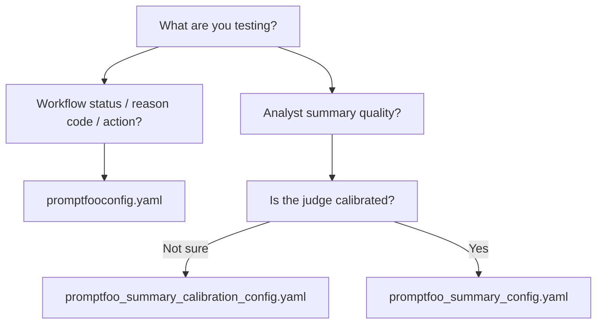

---

## 13. One-Sentence Summary

Promptfoo will automate the manual eval process we designed: it runs each test case, captures the `agent_summary`, asks an LLM judge to score it against our golden dataset and rubric, and reports whether the summary passes or fails.

---

## 14. Files in This Repo

| File | Role |
|---|---|
| `AI Evals_SM5_v0.6.xlsx` | Human source of truth for 3 starter docs, rubric, calibration scores (local, not in repo) |
| `evals/summary_cases.yaml` | Machine-readable golden copy for Promptfoo (**10 docs**) |
| `evals/model_outputs.jsonl` | Append-only log of summary eval judge results |
| `src/cfin_agents/eval_results.py` | Batch runner, JSONL I/O, optional Excel export |
| `src/cfin_agents/observability.py` | Langfuse tracing for production/workbench (not used by eval assertions) |
| `.github/workflows/ci.yml` | CI workflow — see [`CI.md`](CI.md) |
| `docs/ARCHITECTURE.md` | System architecture, API, observability |
| `DEPLOYMENT.md` | Railway deployment guide |
| `evals/deterministic_cases.yaml` | Exact workflow expectations (no LLM judge) |
| `evals/promptfooconfig.yaml` | Promptfoo config for deterministic evals |
| `evals/promptfoo_summary_config.yaml` | Promptfoo config for live workflow + LLM judge |
| `evals/promptfoo_summary_calibration_config.yaml` | Promptfoo config to calibrate judge vs human labels |
| `evals/summary_calibration_cases.yaml` | Six human pass/fail calibration summaries |
| `src/cfin_agents/summary_judge.py` | LLM judge prompt + dual gate scoring |
| `evals/summary_provider.py` | Runs workflow and returns `agent_summary` |
| `evals/summary_assertions.py` | Promptfoo smoke + judge + calibration assertions |
| `scripts/run_deterministic_evals.sh` | Run all deterministic tests |
| `scripts/run_summary_calibration.sh` | Calibrate judge only |
| `scripts/run_summary_evals.sh` | Run calibration + live judged evals (10 docs) + JSONL log |
| `scripts/run_summary_eval_batch.sh` | Programmatic batch + JSONL log only |
| `scripts/log_summary_eval_results.py` | CLI wrapper for batch + optional Excel export |
| `Evals-Journey.md` | Session log + [eval concepts guide](Evals-Journey.md#evals-concepts-ground-up-guide) — **start here** |
| `promptfoo.md` | This file — human grading to automation |
